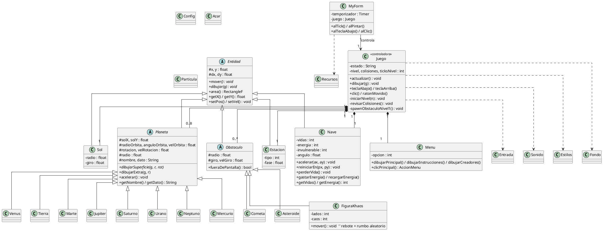

# Diagrama de Clases UML — PoliNavis: Viaje Interestelar

Aplicación de los 4 principios de POO:
- **Abstracción:** `Entidad`, `Planeta` y `Obstaculo` son clases **abstractas** con métodos virtuales puros.
- **Encapsulamiento:** los atributos son `protected/private`; se acceden por `get/set`.
- **Herencia:** toda figura del juego hereda de `Entidad`.
- **Polimorfismo:** `Juego` recorre listas de `Planeta^` y `Obstaculo^` llamando `mover()`/`dibujar()` sin conocer el tipo concreto.

---

## 1. Código PlantUML
> Pégalo en https://www.plantuml.com/plantuml para ver el diagrama renderizado.



---

## 2. Versión en texto (por si no puedes renderizar)

```
                         ┌───────────────────────────┐
                         │      Entidad (abstracta)   │
                         │  # x, y, dx, dy            │
                         │  + mover()  *abstracto*    │
                         │  + dibujar(g) *abstracto*  │
                         │  + area()                  │
                         └────────────┬──────────────┘
        ┌──────────────┬──────────────┼───────────────┬───────────────┐
        ▼              ▼              ▼               ▼               ▼
     ┌──────┐      ┌──────┐   ┌───────────────┐  ┌──────────────┐  ┌──────────┐
     │ Nave │      │ Sol  │   │   Planeta     │  │  Obstaculo   │  │ Estacion │
     └──────┘      └──────┘   │ (abstracta)   │  │ (abstracta)  │  └──────────┘
                              │ órbita+rotación│  │ trayectoria │
                              └──────┬────────┘  └──────┬───────┘
              ┌──────┬──────┬────────┼──────┬──────┐    ├── Cometa
              ▼      ▼      ▼        ▼      ▼      ▼    ├── Asteroide
          Mercurio Venus Tierra  Júpiter Saturno ...   └── FiguraKhaos (Nivel 2)
                          (detalle) (anillos)

   ┌─────────────────────────── Juego (CLASE CONTROLADORA) ───────────────────────────┐
   │  estado, nivel, colisiones, ticksNivel                                            │
   │  posee: 1 Nave, 1 Sol, 0..8 Planeta, 0..* Obstaculo, 1 Estacion, 1 Menu           │
   │  + actualizar()  + dibujar()  + revisarColisiones()  + iniciarNivel()             │
   └───────────────────────────────────────────────────────────────────────────────────┘
                                        ▲
                                        │ controla
                                   ┌─────────┐
                                   │ MyForm  │  (ventana única + Timer 60 fps)
                                   └─────────┘

   Clases de apoyo: Entrada, Config, Azar, Sonido, Estilos, Particula, Fondo, Recursos.
```

---

## 3. Dónde se ve cada principio en el código

| Principio | Evidencia en el proyecto |
|-----------|--------------------------|
| **Abstracción** | `Entidad`, `Planeta`, `Obstaculo` con `= 0` (virtual puro) |
| **Encapsulamiento** | `x,y` son `protected`; se usan `getX()/setPos()`; nadie los toca directo desde fuera |
| **Herencia** | `Nave`, `Sol`, `Planeta`, `Obstaculo`, `Estacion` heredan de `Entidad`; los 8 planetas de `Planeta` |
| **Polimorfismo** | `for each (Planeta^ p in planetas) p->mover();` y `o->dibujar(g)` llaman a la versión concreta correcta |
| **Clase controladora** | `Juego` integra y coordina todas las clases (rúbrica: 3 pts) |
