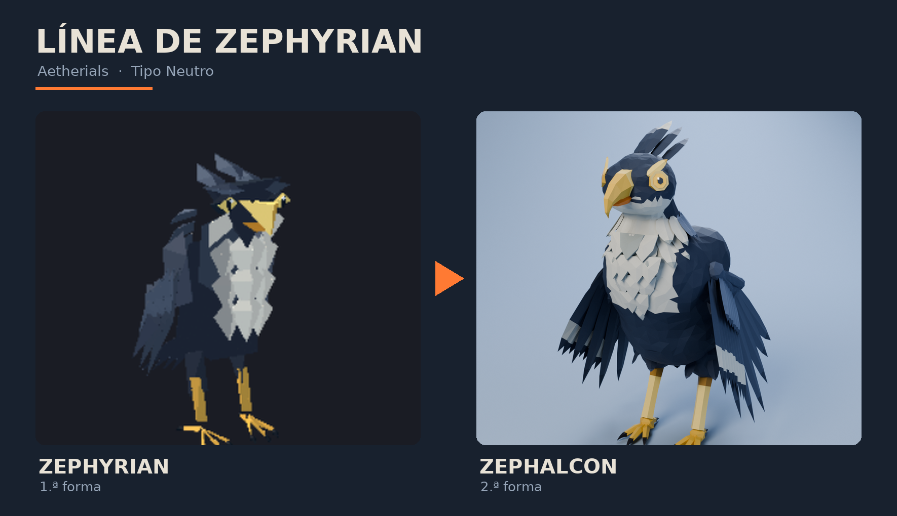

# Aetherials — diseños 3D

## Línea de Vulcanid (Fuego / Roca)

| Forma | Carpeta | Idea |
|---|---|---|
| 1. Vulcanid | (modelo original) | Lagarto de roca con placas abovedadas y grietas de magma |
| 2. **Basaltor** | [`basaltor/`](basaltor/) | El magma se enfría en columnas de basalto con una grieta de lava en el lomo y un mazo en la cola |
| 3. **Obsidrax** | [`obsidrax/`](obsidrax/) | Erupción: la lava se vuelve obsidiana. Melena de cristales, corazón de magma, ojos de lava y orbe en la cola |

## Línea de Zephyrian (Neutro)

| Forma | Carpeta | Idea |
|---|---|---|
| 1. Zephyrian | (modelo original) | Pequeña rapaz azul marino con pecho blanco en "V" y pico dorado |
| 2. **Zephalcon** | [`zephalcon/`](zephalcon/) | Halcón cazador de viento: pechera de chevrones, collar, máscara dorada, alas grandes y cola con estelas |

## Qué trae cada carpeta

Renders, GIFs (caminando y girando; Zephalcon también volando), archivos de Blender, un GLB, los FBX
para Roblox (con esqueleto, piezas sueltas y animaciones) y un script de configuración para Roblox Studio.

El código que genera todos los modelos está en [`fuente/`](fuente/) (Python + Blender 5.0,
`pip install bpy==5.0.1 pillow`): `build_basaltor.py`, `build_obsidrax.py`, `build_zephalcon.py` y los
scripts compartidos de exportación y render.
