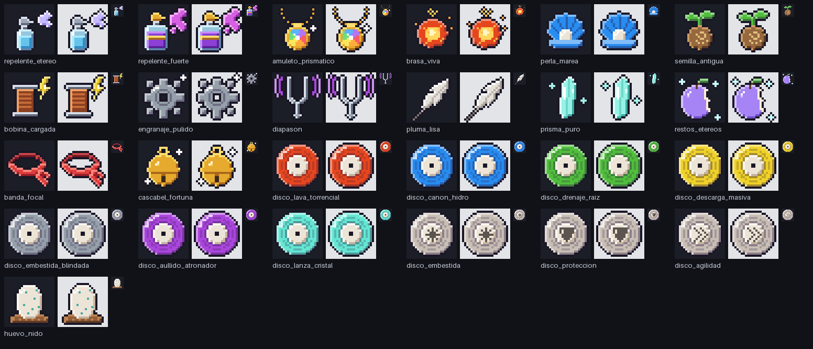
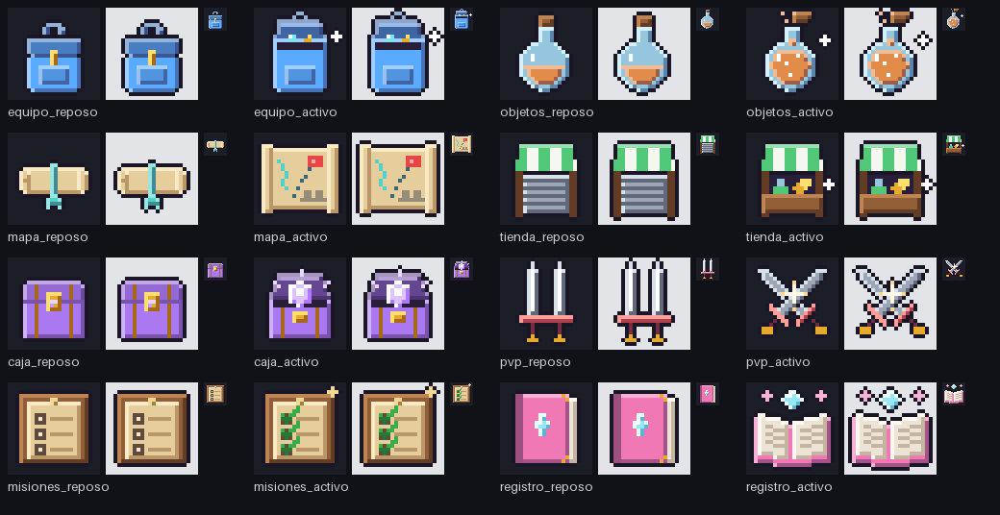
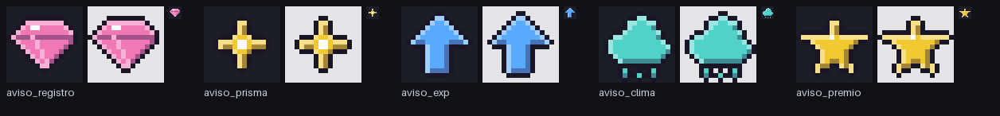

# Iconos nuevos para Aetherials (pixel art)

Respuesta al pedido del lado del código: **46 iconos** con las reglas del paquete (alfa binario 0/255,
contorno duro de 1 px, sin texto, nombre = ID en minúsculas y sin tildes).

## Archivos nuevos

| Carpeta | Iconos | Tamaño |
|---|---|---|
| `Arte/iconos_objeto/` | 24 pedidos + `huevo_nido` (el opcional) = **25** | 24×24 |
| `Arte/iconos_dock/` | 8 paneles × `_reposo` / `_activo` = **16** | 24×24 |
| `Arte/ui/` | `aviso_registro`, `aviso_prisma`, `aviso_exp`, `aviso_clima`, `aviso_premio` = **5** | 16×16 |

`_rejilla_nuevos.png` en cada carpeta es solo para revisar (no se sube). Las líneas para el MANIFIESTO
están en [`MANIFIESTO_agregar.txt`](MANIFIESTO_agregar.txt), para pegar **al final** de cada lista.

## Lo que NO pude hacer

**No ejecuté `atlas.py` ni regeneré `Frontend/AtlasData.lua`**: el paquete `Arte/` (con `atlas.py`, el
MANIFIESTO y las hojas actuales) y `Frontend/` no están en ningún repositorio al que tenga acceso (el
repo `Aetherials` de GitHub está vacío). Por eso tampoco hay salida del empaquetador ni round-trip.
Para terminarlo:

1. Copiar las tres carpetas de `Arte/` encima del proyecto. Son archivos nuevos; **antes de pisar nada,
   comprobar que `Arte/iconos_dock/` no tenga ya `equipo_reposo.png`, `mapa_reposo.png`, etc.** (el
   MANIFIESTO ya los nombra; si existen, no copiar esos y avisarme).
2. Pegar las líneas de `MANIFIESTO_agregar.txt` al final de cada lista y, en la hoja "objetos", cambiar
   el lienzo a 256 y las columnas a 10.
3. Ejecutar `atlas.py` como siempre y revisar que las 3 hojas salgan en [OK] y el round-trip en OK.

Tamaños esperados: la hoja "objetos" pasa a 24 + 25 = 49 iconos; en 10 columnas son 5 filas (240×120
dentro del lienzo de 256, o 250 de ancho si `atlas.py` deja 1 px entre celdas; con 2 px no entra en 10
columnas). Los tamaños finales de "dock" y "tipos" dependen de su configuración actual, que no tengo.

Si se sube el proyecto al repo `Aetherials` de GitHub, la próxima vez puedo correr `atlas.py` y
devolver la salida completa.

## Diferencias con lo pedido, y por qué

- **Estilo:** no tenía los iconos actuales para copiar la paleta exacta. Usé contorno `#1A1626` (casi
  negro violáceo) y sombreado de 3 tonos con luz arriba a la izquierda. Si el paquete usa otro color de
  contorno u otras rampas, son constantes (`CONTORNO` en `pixel.py`, rampas en `objetos.py`/`dock.py`) y
  se regenera todo con `python3 generar.py`.
- **`disco_embestida`:** en lugar de un puño lleva una **marca de impacto** (estallido): un puño no se
  lee en 6–7 px. `disco_proteccion` lleva un escudo y `disco_agilidad` una doble flecha »; los tres se
  distinguen entre sí y del resto.
- **Discos con tipo:** solo cambian de color, como se pidió (sin símbolo de tipo en el centro).
- **`prisma_puro`:** obelisco fino, inclinado y transparente. No vi `prisma_basico` y los otros
  prismas de captura, así que conviene compararlo con ellos.
- **`repelente_fuerte`:** frasco más grande, líquido violeta oscuro, atomizador y etiqueta de oro y una
  nube más grande y magenta, para que no se confunda con `repelente_etereo` (celeste y lila).
- **Dock:** cada panel usa su color de acento. "Activo" es el objeto abierto o encendido: mochila con la
  solapa levantada, frasco lleno con el tapón saltando, mapa desplegado, puesto abierto con mercancía,
  cofre abierto con el núcleo brillando, espadas cruzadas con destello, casillas marcadas y libro
  abierto con la gema flotando.

## Cómo se generan

Código en [`../fuente/pixel/`](../fuente/pixel/) (`python3 generar.py <salida>`, solo necesita Pillow).
Cada icono es una función con su ID; `generar.py` valida tamaño, alfa binario y que todo borde exterior
sea contorno, y arma las rejillas de revisión.
