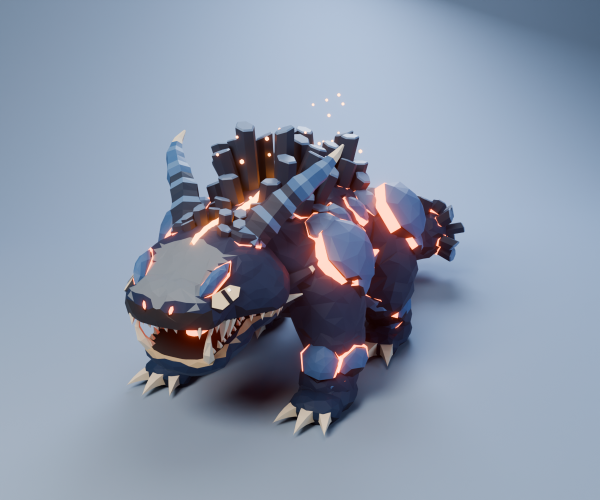
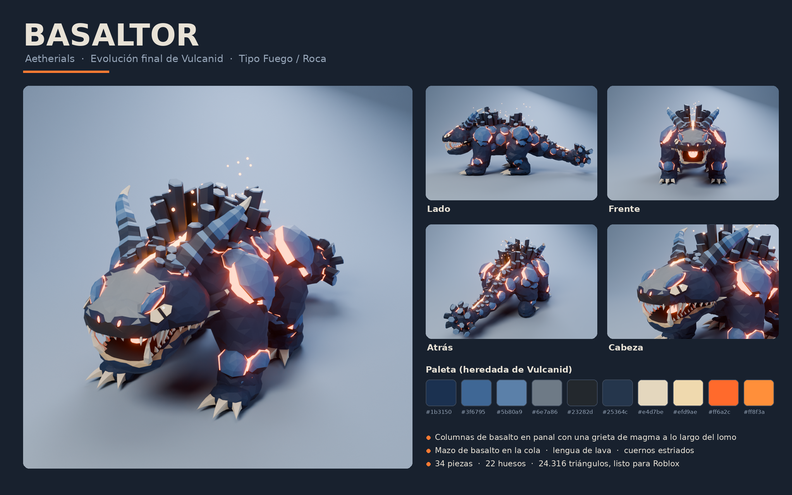
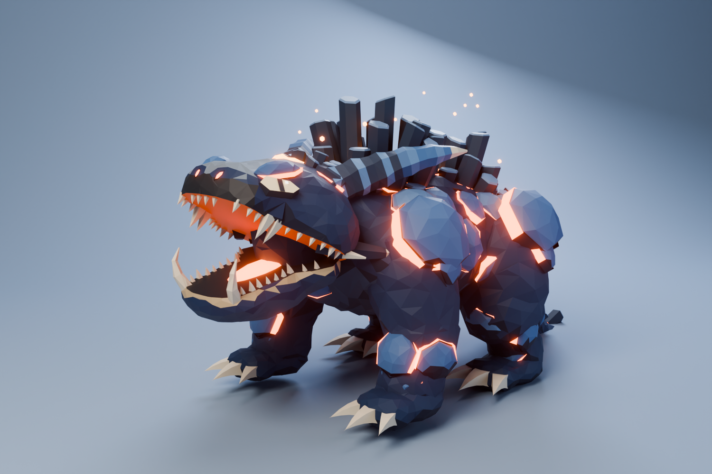
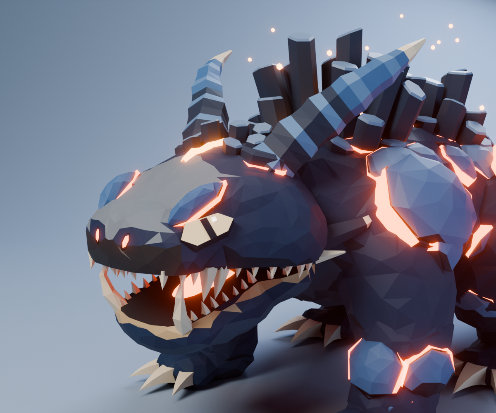
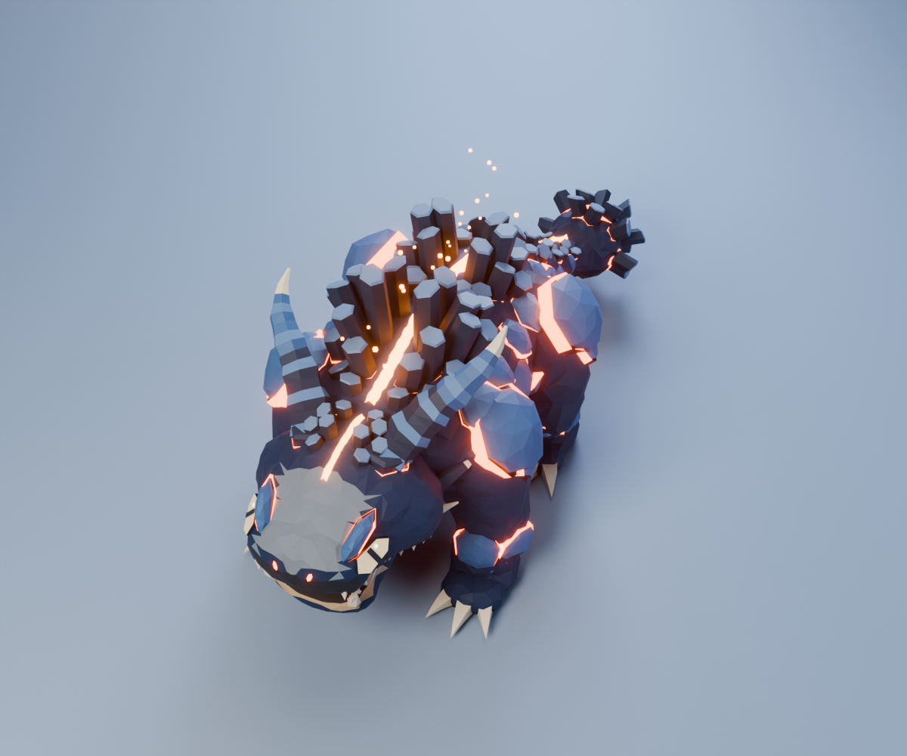
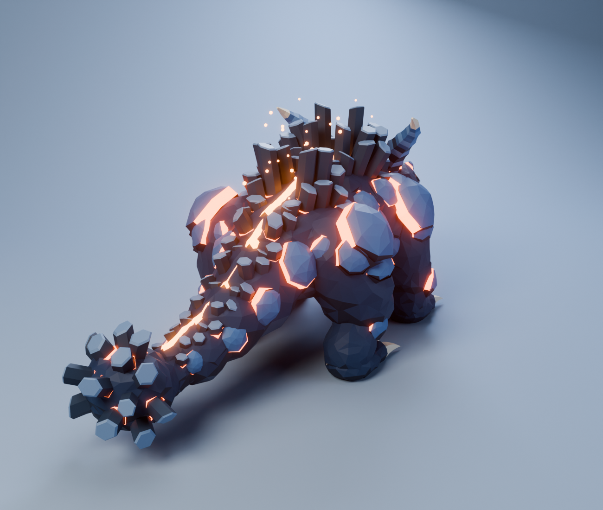
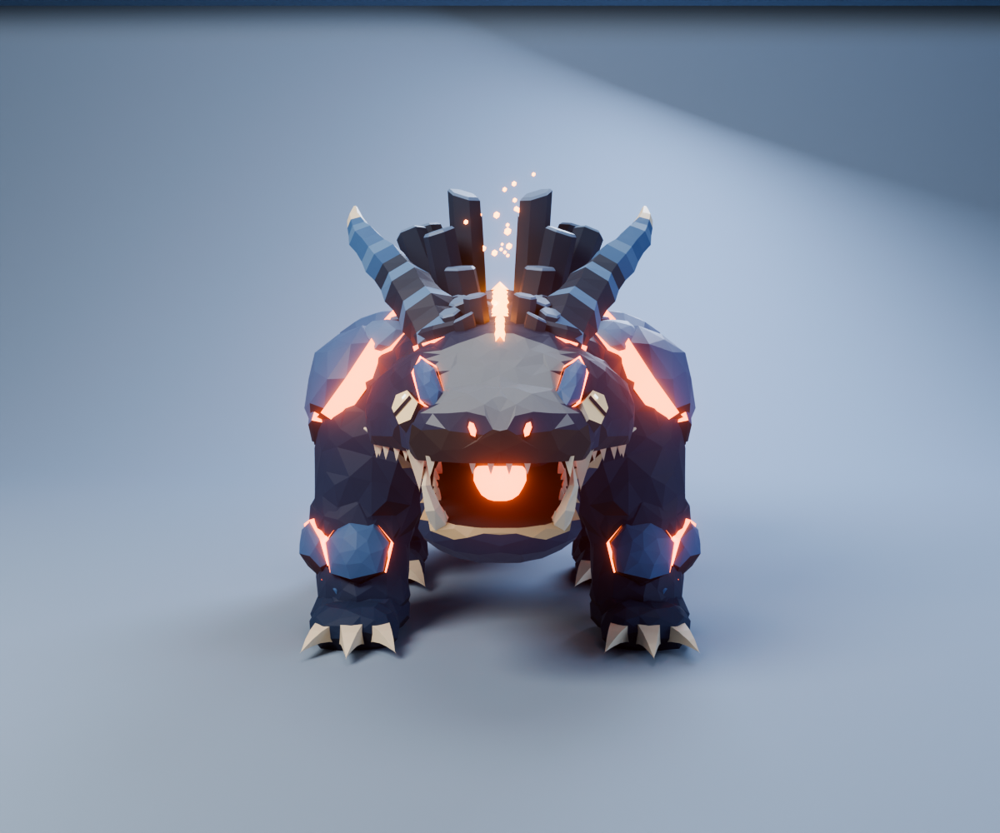
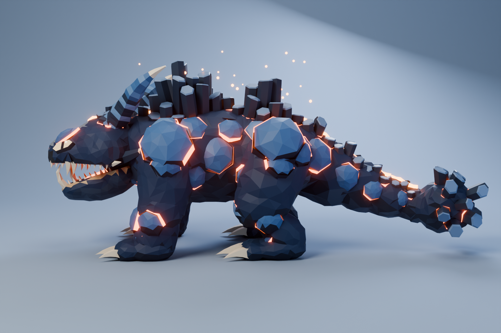
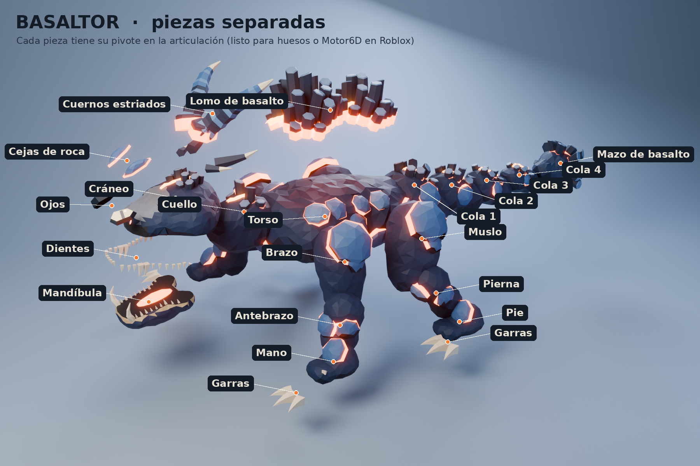

# Basaltor — evolución final de Vulcanid (Aetherials)



> Nombre provisorio: *Basaltor* (basalto + -tor). Lo puedes cambiar sin tocar el modelo.

## Concepto

Cuando Vulcanid madura, el magma que corre bajo sus placas se enfría y cristaliza en
**columnas hexagonales de basalto** a lo largo del lomo, como la Calzada del Gigante.
Entre las dos orillas de columnas queda abierta una **grieta de magma** que nunca se cierra
y le recorre la espalda desde la frente hasta la punta de la cola. La cola termina en un
**mazo de basalto** con el que golpea el suelo. Cuando ruge, la mandíbula se abre de par en
par y deja ver una **lengua de lava**.

| | |
|---|---|
| Línea evolutiva | Vulcanid → (forma intermedia) → **Basaltor** |
| Tipo sugerido | Fuego / Roca |
| Tamaño del modelo | 5,3 m de largo · 2,1 m de ancho · 2,3 m de alto (con cuernos) |
| Postura | cuadrúpedo pesado, patas como pilares |

### Qué hereda de Vulcanid

- La paleta completa: azul marino, azul acero en las placas, gris en el hocico, magma naranja y color hueso.
- Las placas de roca abovedadas con **borde de magma brillante** debajo, en hombros, muslos, brazos y costados.
- Los **ojos hexagonales color crema con pupila vertical** y el brillo cuadrado.
- El labio inferior claro, el hocico ancho con la franja oscura y las garras color hueso.
- El estilo low-poly facetado con sombreado plano.

### Qué lo aleja de Pokémon (Charizard y compañía)

- Es **cuadrúpedo**: no tiene alas, no es bípedo ni tiene llama en la cola.
- La silueta la definen las **columnas de basalto en panal** y la **grieta de magma** del lomo,
  algo que no tiene ninguna criatura de esa saga.
- La cola termina en un **mazo de columnas radiales**, no en fuego.
- Los colores fríos (azul) con magma solo en las grietas son la marca de la línea de Vulcanid.

## Galería





| | |
|---|---|
|  |  |
|  |  |



Video giratorio con la animación de reposo: [`renders/Basaltor_giratorio.mp4`](renders/Basaltor_giratorio.mp4)

## Partes del modelo

Cada parte es un objeto separado, con su punto de pivote en la articulación:

| Zona | Piezas |
|---|---|
| Cabeza | `Craneo` (con corona de basalto, grieta y fosas nasales), `Mandibula` (con lengua de lava, dientes y colmillos), `Dientes_Superiores`, `Ojos`, `Cejas`, `Cuernos` (estriados + púas de mejilla) |
| Cuerpo | `Cuello`, `Torso` (placas laterales y de pecho), `Lomo` (grieta de magma + columnas de basalto) |
| Patas delanteras ×2 | `Brazo` (hombrera), `Antebrazo` (brazal), `Mano`, `Garras` |
| Patas traseras ×2 | `Muslo`, `Pierna`, `Pie`, `Garras` |
| Cola | `Cola_1` a `Cola_4` (cada una con columnas y placas), `Cola_Mazo` |



## Archivos

```
basaltor/
├── renders/        renders finales, vista explotada, hoja de concepto y video giratorio
├── blender/
│   ├── Basaltor.blend        34 piezas con materiales y pivotes + estudio de luces (F12 renderiza)
│   └── Basaltor_Rig.blend    esqueleto (22 huesos) + acciones "Reposo" y "Rugido"
├── roblox/
│   ├── Basaltor_Roblox_Rig.fbx      modelo con esqueleto, listo para importar (42 MeshParts)
│   ├── Basaltor_Roblox_Partes.fbx   54 piezas sueltas sin esqueleto (para Motor6D)
│   ├── Basaltor_Anim_Reposo.fbx     animación de reposo (respira, mueve la cola), 2 s en bucle
│   ├── Basaltor_Anim_Rugido.fbx     animación de rugido, 2,5 s
│   ├── Basaltor_Paleta.png          textura de paleta (512×256) que comparten las piezas de roca
│   └── SetupBasaltor.server.lua     pone el magma en Neon y agrega luces, brasas y humo
├── modelos/Basaltor.glb    modelo completo con materiales originales y las dos animaciones
└── fuente/                 scripts de Python/Blender que generan todo lo anterior
```

## Importarlo en Roblox Studio

1. **File → Import 3D** y elige `roblox/Basaltor_Roblox_Rig.fbx`. Si el importador pregunta
   por el tipo de rig, no es humanoide: usa el rig personalizado (Custom).
2. Las piezas de roca traen la textura `Basaltor_Paleta.png` incrustada. Si no aparece,
   súbela y asígnala como `TextureID` a las MeshParts que **no** terminan en `_Magma`.
3. Arrastra `SetupBasaltor.server.lua` como **Script** dentro del Model importado. Al darle Play:
   - todas las piezas `*_Magma` pasan a material **Neon** (es lo que hace brillar la lava en Roblox),
   - se agregan luces en la grieta, la boca y el mazo,
   - salen brasas y humo de la grieta del lomo.
4. Para la animación: abre el **Animation Editor**, selecciona el modelo, usa
   **Import → From FBX Animation** con `Basaltor_Anim_Reposo.fbx` (o `..._Rugido.fbx`), publícala y
   pega el ID en `ANIMACION_REPOSO` dentro del script.
5. Si el modelo aparece mirando hacia atrás, gíralo 180°. Para cambiarle el tamaño usa
   `Model:ScaleTo()` o la herramienta Scale con el Model seleccionado.

**¿Por qué el magma va en piezas aparte?** En Roblox una MeshPart solo puede tener una textura y
un material, y el brillo solo se consigue con el material Neon. Por eso cada parte del cuerpo
viene en dos mallas: la roca (con la paleta) y su magma (Neon).

### Triángulos por pieza (FBX con esqueleto)

| MeshPart | Triángulos | | MeshPart | Triángulos |
|---|---:|---|---|---:|
| Torso | 4.630 | | Torso_Magma | 1.276 |
| Cabeza (cráneo, ojos, cejas, cuernos, dientes) | 3.418 | | Cabeza_Magma | 292 |
| Mandibula | 1.480 | | Mandibula_Magma | 104 |
| Cola_Mazo | 1.292 | | Cola_Mazo_Magma | 282 |
| Cola_1 … Cola_4 | 840–884 c/u | | Cola_n_Magma | ~200 c/u |
| Cuello | 766 | | Cuello_Magma | 128 |
| Patas (12 piezas) | 438–587 c/u | | Patas _Magma | 19–34 c/u |
| **Total** | **24.316 triángulos en 42 MeshParts** | | | |

La pieza más pesada (Torso, 4.630) está muy por debajo del límite de triángulos por MeshPart de Roblox.

## Cómo está hecho en Blender

Todo el modelo se genera con scripts de Blender 5.0 (carpeta `fuente/`). No hay piezas que
sean figuras geométricas puestas tal cual; cada parte pasa por un flujo de modelado:

1. **Bloqueo con metaballs** de cuerpo, cabeza, mandíbula, patas y cola (elipsoides, cápsulas
   y esferas que se funden como arcilla).
2. **Remesh por vóxeles** para unificar la malla.
3. **Tallado procedural de roca**: ruido fractal más celdas Voronoi a lo largo de la normal, simétrico en X.
4. **Decimate (Collapse) con simetría** para el facetado low-poly de Vulcanid, y **Symmetrize** para
   que ambos lados queden idénticos.
5. **Bisect + relleno** para el corte de la boca y las plantas de los pies.
6. **Ray casting con BVH** para pegar placas, columnas, ojos, cejas y dientes exactamente sobre
   la superficie, orientados según su normal.
7. **Panal hexagonal** para las columnas de basalto: alturas escalonadas, tapas inclinadas y
   biseladas, y un anillo de magma en la base de cada columna.
8. **Tubos con radio variable** sobre curvas para los cuernos estriados, las púas y los colmillos.
9. **Armature** con un hueso por articulación (22), cada pieza amarrada a su hueso, y dos acciones
   (Reposo y Rugido).
10. **Render en Cycles** con eliminación de ruido (OpenImageDenoise) y bloom en el compositor.

Para regenerar todo (Python 3.11): `pip install bpy==5.0.1 pillow` y luego, dentro de `fuente/`:

```bash
python3 build.py                               # modela las piezas -> basaltor.blend
python3 export_roblox.py basaltor.blend out    # paleta, rig, animaciones, FBX y GLB -> out/
python3 final_renders.py -- renders 128        # renders finales (Cycles, 128 muestras)
python3 preview.py basaltor.blend prev/v 720 540 32 frente34,lado,cabeza   # vistas rapidas
```
En `lib.py` (PALETTE) se cambian los colores y en `build.py` las proporciones y las semillas
de las placas y columnas.
