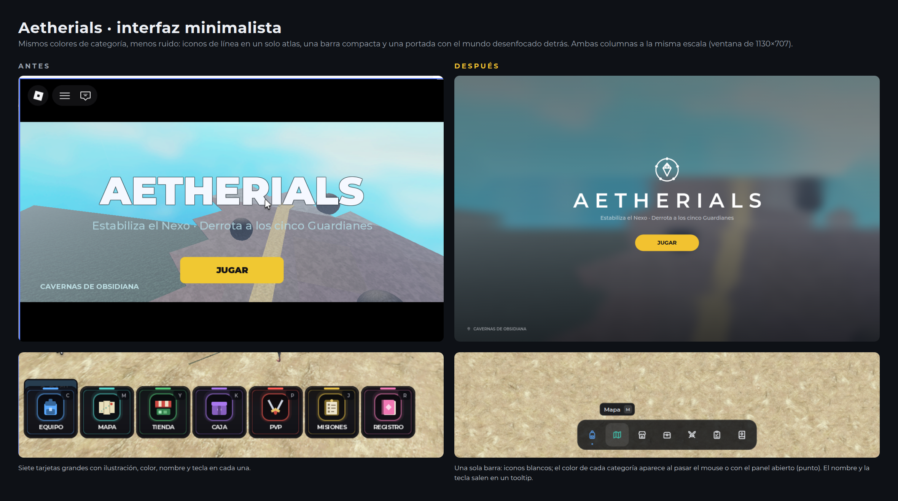
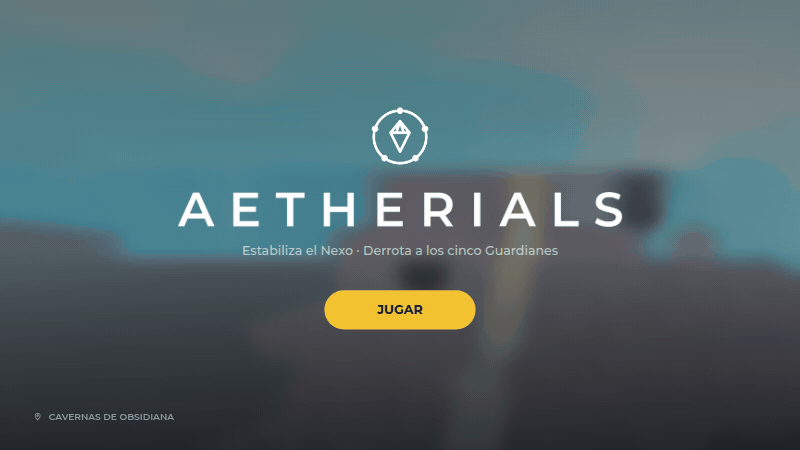
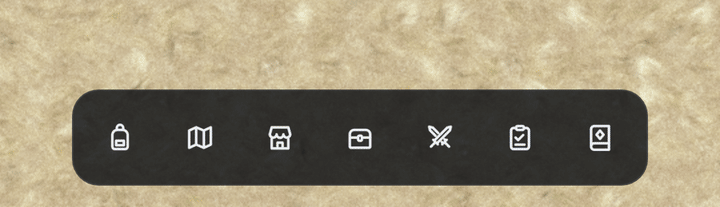
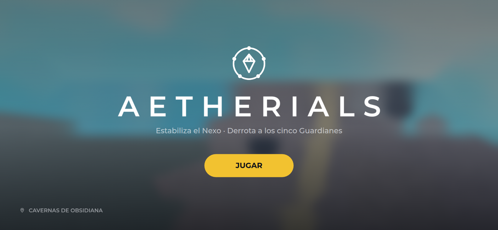
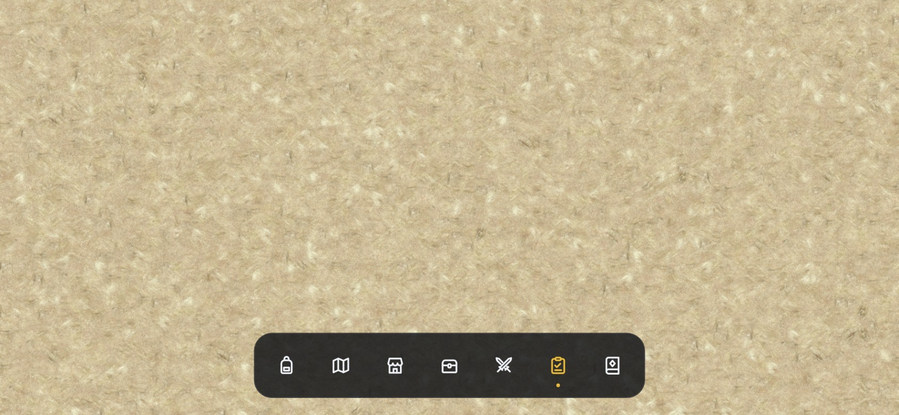

# Interfaz de Aetherials — versión minimalista



Rediseño de la **pantalla de inicio** y de la **barra de menú** con sprites: iconos de línea blancos,
un emblema y el logotipo, todo en **un solo atlas** que se sube una vez a Roblox.

## Ideas del diseño

- **Menos ruido:** las 7 tarjetas grandes con ilustración, nombre y tecla pasan a ser una barra compacta
  de iconos. El nombre y la tecla aparecen en un tooltip al pasar el mouse.
- **Se mantienen los colores de cada categoría** (azul, turquesa, verde, morado, rojo, oro, rosa), pero
  solo como acento: el icono se tiñe al pasar el mouse y un punto marca el panel abierto.
- **Un único color de acción:** el oro del botón JUGAR.
- **Portada:** el mundo del juego desenfocado detrás (`BlurEffect`), un velo oscuro en degradado, el
  emblema del Nexo, el logotipo con letras espaciadas, el subtítulo y JUGAR. La zona va abajo a la
  izquierda, pequeña. Se quitan las barras negras y el contorno grueso del título.
- **Emblema del Nexo:** el cristal al centro y un anillo con **cinco puntos, los cinco Guardianes**, que
  gira despacio (una vuelta cada 40 s).





## Sprites

| Archivo | Contenido |
|---|---|
| `sprites/Aetherials_UI_Atlas.png` | **El que se sube a Roblox** (1024×1024): los 9 iconos, el emblema en partes y el logotipo |
| `sprites/iconos/*.png` | Cada icono suelto a 256×256: equipo, mapa, tienda, caja, pvp, misiones, registro, ubicacion, cerrar |
| `sprites/Logo_Aetherials.png` | El logotipo suelto |
| `sprites/Nexo_Anillo.png`, `Nexo_Cristal.png`, `Nexo_Emblema.png` | El emblema suelto (512×512) |

Todos son blancos sobre fondo transparente; Roblox los tiñe con `ImageColor3`, así que no hacen falta
versiones de color ni de "hover".

Posiciones en el atlas (`ImageRectOffset` / `ImageRectSize`):

| Sprite | x, y, ancho, alto |
|---|---|
| equipo · mapa · tienda · caja · pvp · misiones · registro · ubicacion | fila de arriba, celdas de 128 (x = 0, 128, … 896; y = 0) |
| cerrar | 0, 128, 128, 128 |
| nexo_anillo · nexo_cristal · nexo | 0 / 256 / 512, 256, 256, 256 |
| logo | 28, 516, 968, 83 |

## Instalarlo en Roblox Studio

1. Sube `sprites/Aetherials_UI_Atlas.png` (Asset Manager → Import, o Creator Hub) y copia su ID.
2. Pon `roblox/InterfazAetherials.client.lua` como **LocalScript** en
   `StarterPlayer > StarterPlayerScripts` y pega el ID en `ATLAS`.
3. En `GUIS_A_OCULTAR` escribe los nombres de tu pantalla de inicio y tu barra actuales (el script
   las desactiva) o bórralas.
4. En `BOTONES`, agrega `panel = "NombreDeTuPanel"` a cada botón para que abra tu ScreenGui o Frame
   (si no lo pones, busca uno que se llame igual que el `id`). Al abrir un panel se cierra el anterior,
   y si tu panel se cierra con su propia X, la barra se entera sola.
5. Si tu JUGAR viejo avisaba al servidor, pon el nombre del RemoteEvent en `REMOTO_JUGAR`, o escucha
   el evento desde otro script:

```lua
local menu = game.Players.LocalPlayer.PlayerGui:WaitForChild("AetherialsMenu")
menu.Jugar.Event:Connect(function() --[[ se pulsó JUGAR ]] end)
menu.Boton.Event:Connect(function(id, abierto) --[[ "Mapa", true ]] end)
```

Otras opciones del script: `MOSTRAR_INICIO`, `SUBTITULO`, `ZONA` (o el atributo `Zona` del jugador,
que actualiza el texto en vivo) y `POSICION_MENU = "izquierda"` para una barra vertical.

## Controles

- **Teclado:** C, M, Y, K, P, J, R abren cada panel (no se activan mientras escribes en el chat). Enter = JUGAR.
- **Mando:** JUGAR queda seleccionado (botón A); en el juego, la barra se recorre con la navegación de
  interfaz de Roblox (botón Select).
- **Táctil:** sin tooltips de mouse; al tocar un botón aparece su nombre 1,2 s.
- **Tamaño:** se adapta al alto de la pantalla (barra entre ×0,85 y ×1,1; portada entre ×0,7 y ×1,25).

| Celular (844×390) | |
|---|---|
|  |  |

## Qué está comprobado y qué no

- El script compila sin errores (`luau-compile`) y pasa `luau-lsp analyze` con las definiciones de la API
  de Roblox.
- Además revisé contra esa API las 184 propiedades que el script asigna, los 29 valores de `Enum` y
  todos los métodos y eventos que usa: todos existen.
- Los mockups replican las mismas medidas, colores y fuente (Montserrat) que el script, sobre tus capturas.
- **No lo pude probar dentro de Roblox Studio.** La primera vez, revisa que tu barra vieja quede desactivada
  (si no, las teclas abrirían los paneles dos veces) y que los nombres de tus paneles coincidan.

## Cómo se hicieron los sprites

Los iconos están dibujados como SVG en una grilla de 24 (trazo 2, puntas redondeadas), el emblema en
una de 64 y el logotipo con Montserrat. Se renderizan con Chromium y se juntan en el atlas:

```
cd ../fuente/interfaz
npm install playwright-core @fontsource-variable/montserrat
node render.js && python3 armar_atlas.py
```

Para cambiar un icono, edita su trazo en `iconos.js` y vuelve a correr los dos comandos.
