# Obsidrax — forma final de Vulcanid (Aetherials)

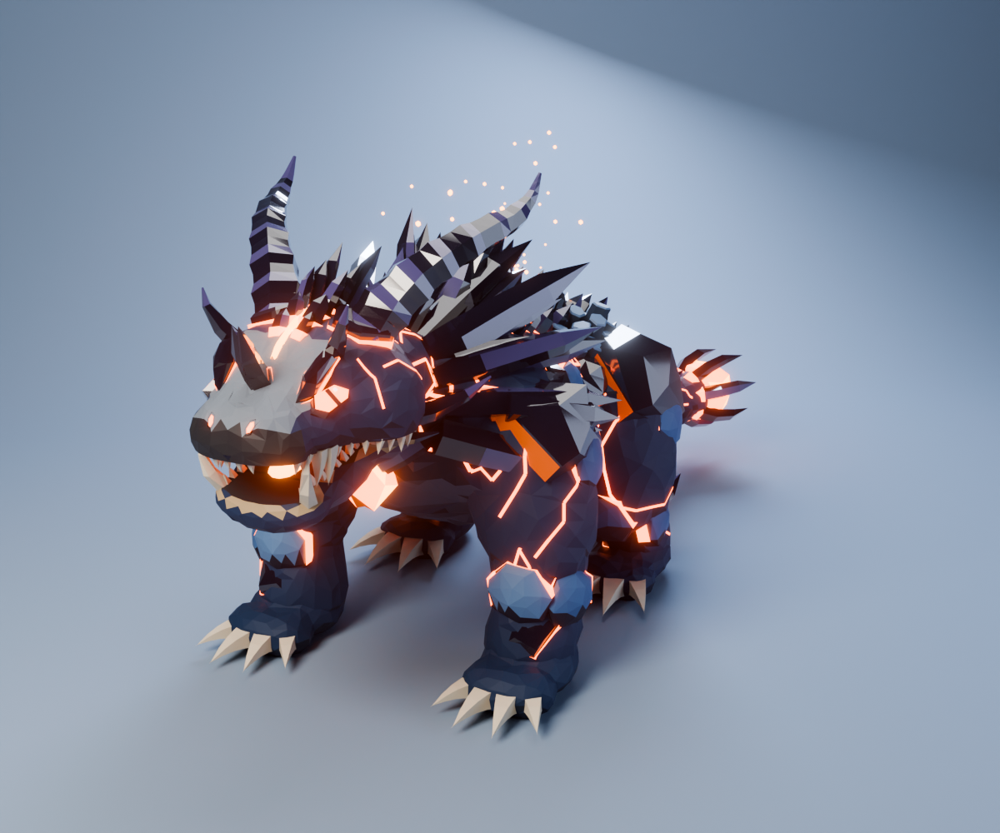

> Nombre provisorio: *Obsidrax* (obsidiana + -rax). Lo puedes cambiar sin tocar el modelo.

## Concepto

Cuando Basaltor acumula suficiente calor, la grieta de su lomo hace erupción. El magma, al
enfriarse de golpe, no alcanza a formar columnas de basalto: se vuelve **obsidiana**, vidrio
volcánico negro, brillante y afilado. Obsidrax lleva una **melena de cristales de obsidiana**
alrededor del cuello, y su **corazón de magma** brilla en el pecho, sujeto por costillas de cristal.
El calor ya no cabe dentro del cuerpo: le corre en **grietas de lava** por la piel, le ilumina los
**ojos** y se acumula en un **orbe de magma** enjaulado en la punta de la cola.

| | |
|---|---|
| Línea evolutiva | Vulcanid → [Basaltor](../basaltor/) → **Obsidrax** |
| Tipo sugerido | Fuego / Roca |
| Tamaño del modelo | 7,3 m de largo · 2,8 m de ancho · 3,5 m de alto (con cuernos) |
| Postura | cuadrúpedo imponente, pecho alto y patas delanteras poderosas |

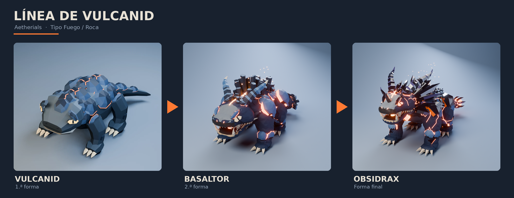

### Qué hereda de la línea

- **De Vulcanid:** azul marino, placas de roca azul acero con borde de magma, hocico gris con franja
  oscura, labio claro, garras color hueso y ojos hexagonales con pupila vertical.
- **De Basaltor:** la grieta de magma del lomo (ahora un río más ancho), los cuernos estriados
  (ahora una corona de obsidiana), el panal de columnas de basalto (queda en la cadera) y la
  lengua de lava.

### Qué cambia (la escalada)

- **Obsidiana**: un material nuevo, vidrio negro violáceo muy brillante, en la melena, las hojas
  del lomo, la corona, las cejas, las hombreras y la jaula del orbe.
- **Melena de cristales** alrededor del cuello: es la silueta que lo distingue.
- **Corazón de magma** visible en el pecho, como una gema facetada.
- **Ojos de magma fundido**: la misma forma de la familia, pero ahora brillan.
- **Grietas de lava** que siguen las facetas del cuerpo.
- **Cuerno nasal** y **cuernos de ceja** además de la corona.
- **Cola** terminada en un **orbe de magma enjaulado** por garras de obsidiana.
- Es un 37 % más grande que Basaltor, con el pecho más alto y garras de 4 dedos.

Sigue siendo cuadrúpedo, sin alas ni llama en la cola, para mantenerse lejos de Charizard y del
resto de la saga.

## Galería

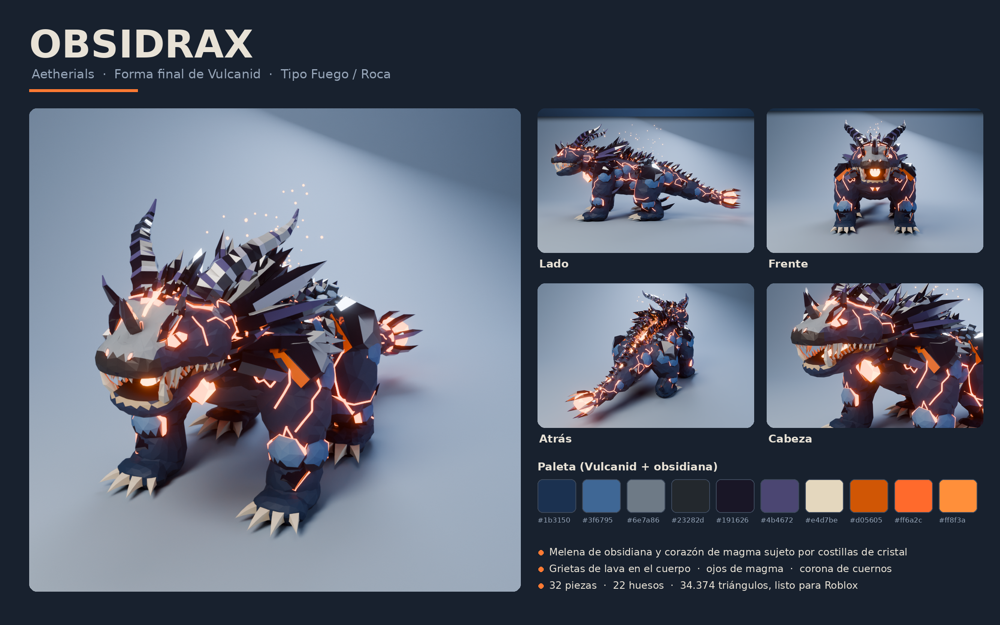

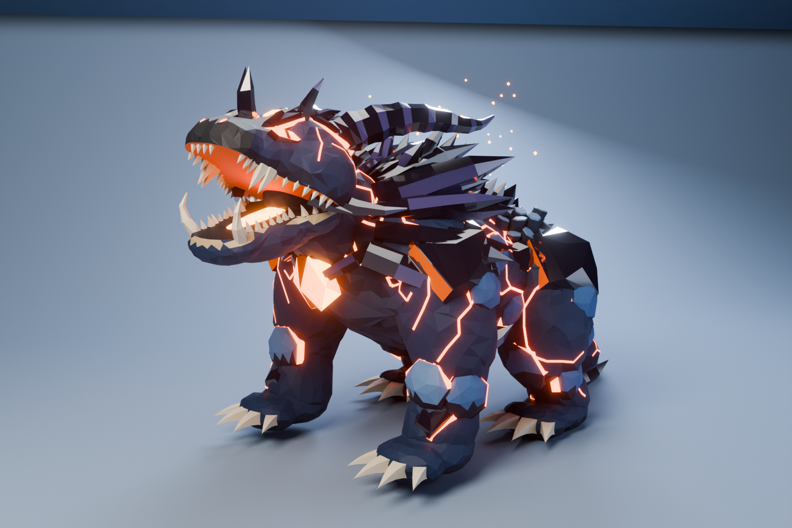

| | |
|---|---|
| 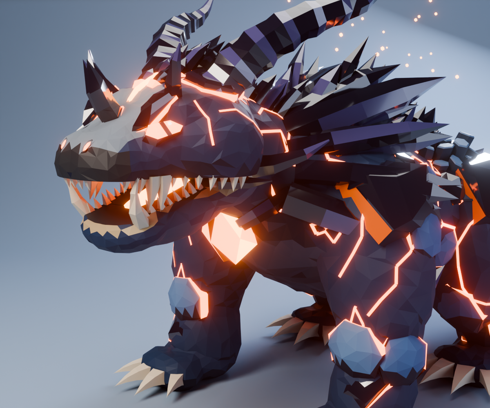 | 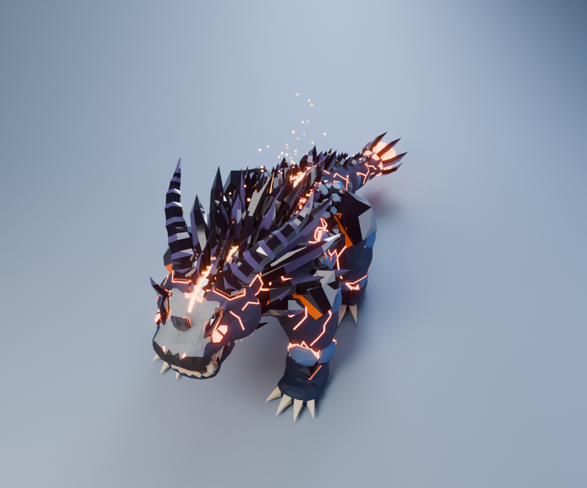 |
| 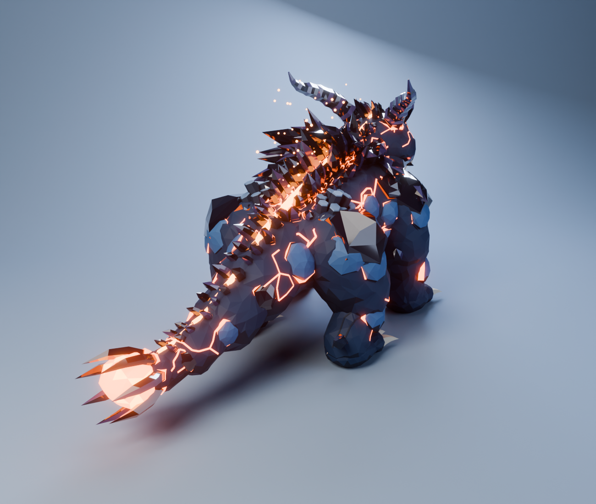 | 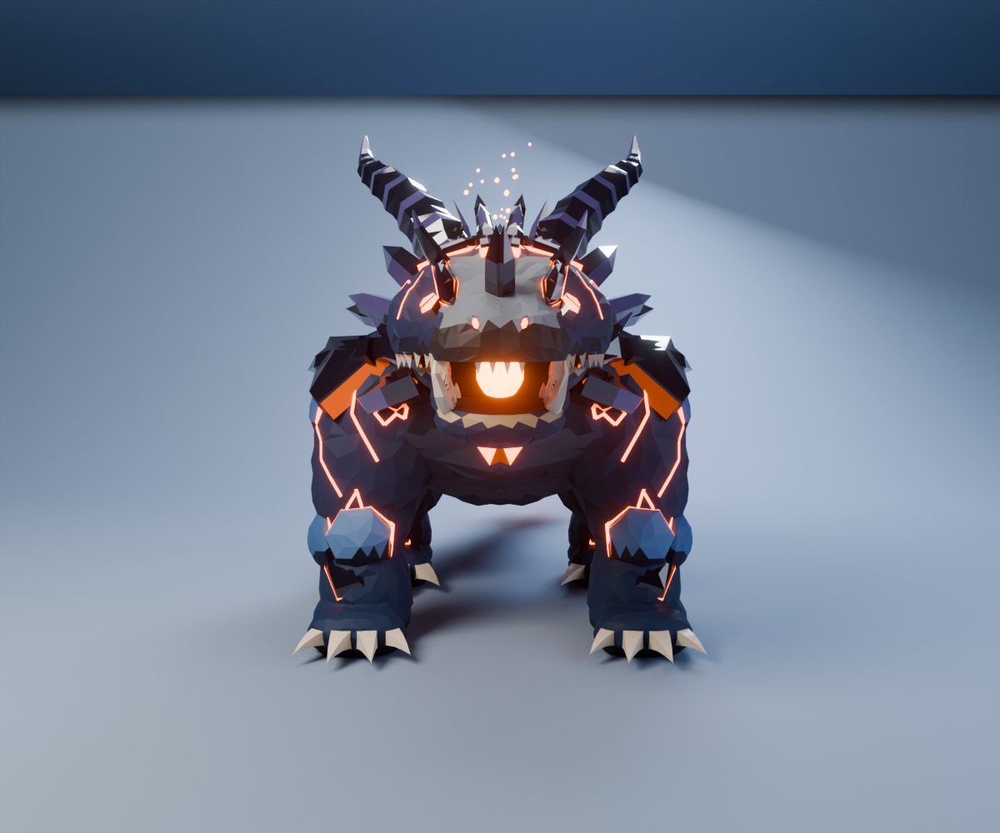 |

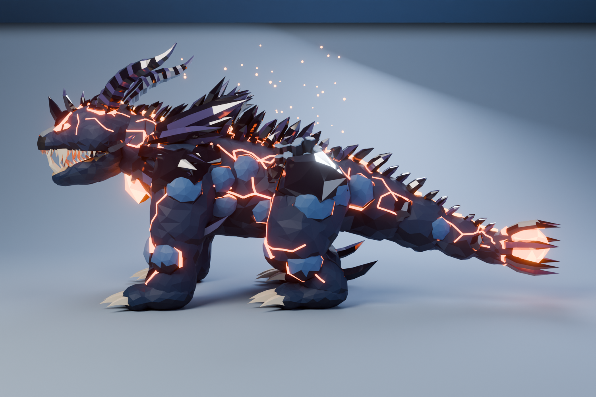

### Caminando

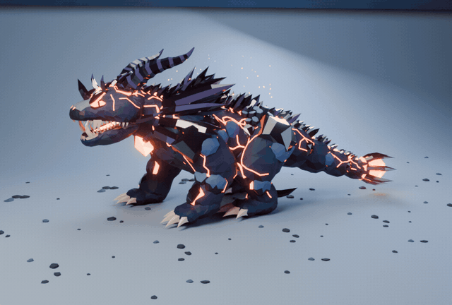

Paso lateral de cuadrúpedo pesado, 1,4 s por ciclo, con cinemática inversa en cada pata para que
los pies queden plantados. MP4: [`renders/Obsidrax_caminata.mp4`](renders/Obsidrax_caminata.mp4)

### Girando

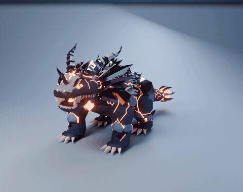

MP4: [`renders/Obsidrax_giratorio.mp4`](renders/Obsidrax_giratorio.mp4)

### Tamaño comparado con Basaltor

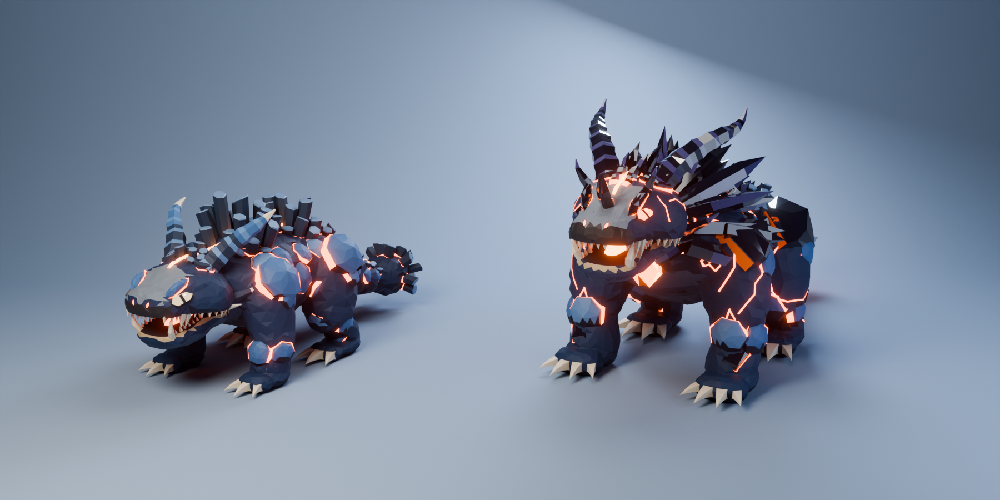

## Partes del modelo

Son 32 piezas, cada una con su pivote en la articulación:

| Zona | Piezas |
|---|---|
| Cabeza | `Craneo` (cresta de hojas, grietas, fosas nasales), `Mandibula` (lengua de lava, dientes, colmillos), `Dientes_Superiores`, `Ojos` (magma), `Cejas` (obsidiana), `Cuernos` (corona estriada, cuernos de ceja, cuerno nasal, púas de mejilla) |
| Cuerpo | `Cuello`, `Torso` (placas, grietas), `Lomo` (río de magma, hojas de obsidiana, panal de basalto), `Torso__Melena`, `Torso__Nucleo` (corazón de magma) |
| Patas delanteras ×2 | `Brazo` (hombrera de obsidiana), `Antebrazo` (púa en el codo), `Mano` (4 dedos), `Garras` |
| Patas traseras ×2 | `Muslo`, `Pierna` (púa en el talón), `Pie`, `Garras` |
| Cola | `Cola_1` a `Cola_4` (hojas de obsidiana), `Cola_Mazo` (orbe de magma enjaulado) |

Las piezas con `__` en el nombre (`Torso__Melena`, `Torso__Nucleo`) son detalles que van amarrados
al hueso que indica la primera parte del nombre.

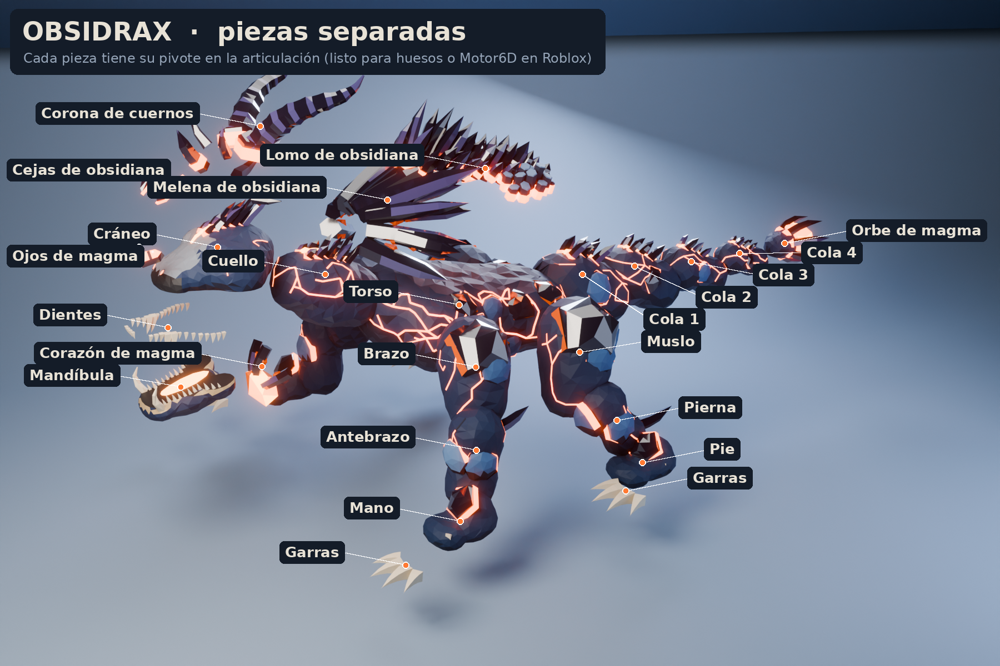

## Archivos

```
obsidrax/
├── renders/        renders, hoja de concepto, vista explotada, caminata, giratorio y comparación
├── blender/
│   ├── Obsidrax.blend        32 piezas con materiales y pivotes + estudio de luces (F12 renderiza)
│   └── Obsidrax_Rig.blend    esqueleto (22 huesos) + acciones "Reposo", "Rugido" y "Caminar"
├── roblox/
│   ├── Obsidrax_Roblox_Rig.fbx      modelo con esqueleto, listo para importar (45 MeshParts)
│   ├── Obsidrax_Roblox_Partes.fbx   58 piezas sueltas sin esqueleto (para Motor6D)
│   ├── Obsidrax_Anim_Reposo.fbx     animación de reposo, 2 s en bucle
│   ├── Obsidrax_Anim_Rugido.fbx     animación de rugido, 2,5 s
│   ├── Obsidrax_Anim_Caminar.fbx    ciclo de caminata en el lugar, 1,4 s en bucle
│   ├── Obsidrax_Paleta.png          textura de paleta (512×256) de las piezas de roca y obsidiana
│   └── SetupObsidrax.server.lua     magma en Neon, luces (corazón, boca, lomo, orbe), brasas, patrulla
└── modelos/Obsidrax.glb    modelo completo con materiales originales y las tres animaciones
```

El código que genera todo está en [`../fuente/`](../fuente/), compartido con Basaltor.

## Importarlo en Roblox Studio

Igual que Basaltor:

1. **File → Import 3D** con `roblox/Obsidrax_Roblox_Rig.fbx` (rig personalizado, no humanoide).
2. Si la paleta no aparece, sube `Obsidrax_Paleta.png` y ponla como `TextureID` en las MeshParts que
   **no** terminan en `_Magma`.
3. Pon `SetupObsidrax.server.lua` como **Script** dentro del Model. Pasa el magma a **Neon** y agrega
   luces en el corazón, la boca, el lomo y el orbe, además de brasas y humo.
4. Publica las animaciones desde el **Animation Editor** (Import → From FBX Animation) y pega sus IDs
   en `ANIMACION_REPOSO` y `ANIMACION_CAMINAR`.
5. Con `PATRULLAR = true` camina ida y vuelta a la velocidad sin patinar (0,735 m/s con el tamaño
   original). El script la ajusta solo si lo importaste a otra escala.

En Roblox el brillo violeta de la obsidiana se ve como un color plano: la paleta guarda el tono,
pero los reflejos de vidrio solo aparecen en Blender, en los renders y en el GLB.

### Triángulos por pieza (FBX con esqueleto)

| MeshPart | Triángulos | | MeshPart | Triángulos |
|---|---:|---|---|---:|
| Torso (torso + lomo) | 6.172 | | Torso_Magma | 1.982 |
| Cabeza | 4.172 | | Cabeza_Magma | 412 |
| Torso__Melena | 3.612 | | Torso__Nucleo (+ _Magma) | 420 (+20) |
| Mandibula | 1.892 | | Mandibula_Magma | 104 |
| Cuello | 1.226 | | Cuello_Magma | 362 |
| Cola_1 … Cola_4, Cola_Mazo | 834–914 c/u | | Cola _Magma | 222–256 c/u |
| Patas (12 piezas) | 621–704 c/u | | Patas _Magma | 13–66 c/u |
| **Total** | **34.374 triángulos en 45 MeshParts** | | | |

La pieza más pesada (Torso, 6.172) queda bajo los 10.000 triángulos por MeshPart.

## Cómo está hecho

El mismo flujo de Basaltor (metaballs → remesh por vóxeles → tallado procedural → decimate con
simetría → piezas por ray casting → rig con IK para caminar), más tres técnicas nuevas:

1. **Cristales de obsidiana**: prismas irregulares con punta facetada y curvatura, con caras de
   brillo alternadas. Los que salen muy inclinados llevan un charco de magma pegado a la superficie
   en vez de un anillo.
2. **Grietas de lava por aristas**: caminatas aleatorias sobre las aristas de la malla low-poly
   (prefiriendo seguir derecho) convertidas en tiras finas emisivas, así las vetas siguen el facetado.
3. **Material de vidrio**: obsidiana con capa de barniz (coat) y especular alto en Cycles.

```bash
cd ../fuente
python3 build_obsidrax.py                                   # -> obsidrax.blend
python3 export_roblox.py obsidrax.blend out_obs Obsidrax    # -> out_obs/
CRIATURA=Obsidrax RIGDIR=out_obs python3 final_renders.py -- renders 128
CRIATURA=Obsidrax RIGDIR=out_obs python3 walk_render.py -- caminata 24 2 800 540
python3 check_walk.py -- out_obs/Obsidrax_Rig.blend         # comprueba que los pies no patinen
```
