# Zephalcon — segunda forma de Zephyrian (Aetherials)

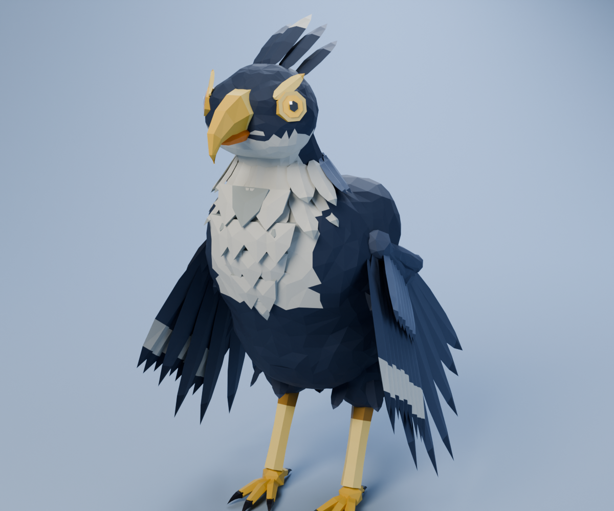

> Nombre provisorio: *Zephalcon* (céfiro + halcón). Lo puedes cambiar sin tocar el modelo.

## Concepto

Zephyrian crece y se convierte en un **halcón cazador de viento**: más alto, más atlético y con
alas mucho más grandes. Las plumas del pecho se endurecen en una **pechera de chevrones** en capas,
como una armadura, y le sale un **collar de plumas** alrededor del cuello. La cresta se alarga hacia
atrás, el anillo dorado del ojo se extiende en una **máscara dorada**, y la cola suma dos plumas
largas, las **estelas de viento**, que ondean cuando vuela.

| | |
|---|---|
| Línea evolutiva | Zephyrian → **Zephalcon** → [Zephyrex](../zephyrex/) |
| Tipo | Neutro |
| Tamaño del modelo | 2,3 m de alto · 2,1 m de largo · 4,55 m de envergadura con las alas abiertas |
| Postura | rapaz erguida; camina, vuela y grita |


### Qué hereda de Zephyrian

- La paleta: azul marino en el cuerpo, azul pizarra en las alas, pecho blanco grisáceo, pico, patas
  y dedos dorados, garras oscuras.
- El pecho de plumas blancas en "V" con borde dentado (ahora en capas de armadura).
- El anillo dorado del ojo, el pico ganchudo dorado con la parte inferior naranja y la cresta hacia atrás.
- El estilo low-poly facetado.

### Qué lo aleja de Pokémon

- La cresta va **hacia atrás** en 5 plumas, no curvada hacia adelante como la de Staraptor.
- La silueta la definen la **pechera de chevrones**, la **máscara dorada** y las **estelas** de la cola.
- Es tipo Neutro sin elementos de fuego, agua ni rayo, y su paleta azul marino y dorado es propia de
  la línea de Zephyrian (ni el marrón de Pidgeot ni el gris y rojo de Staraptor).

## Galería

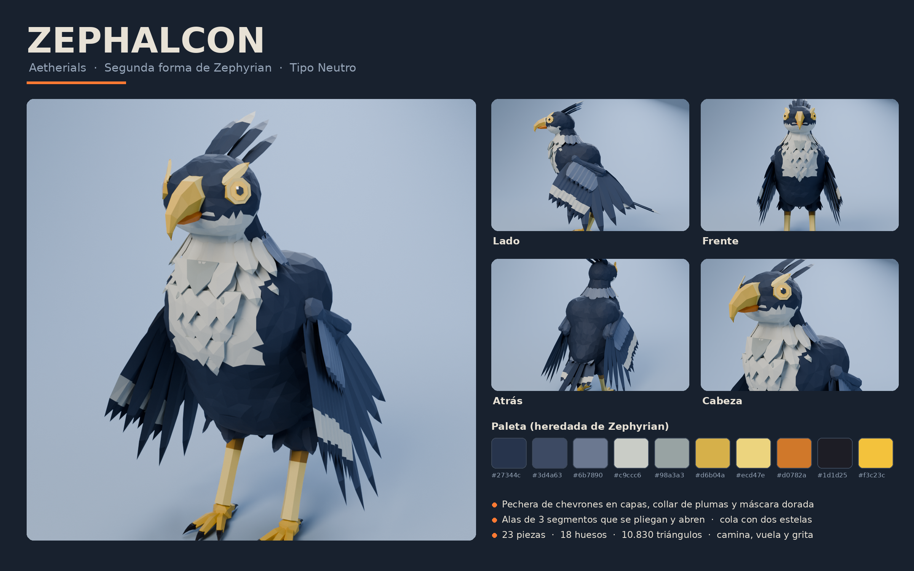

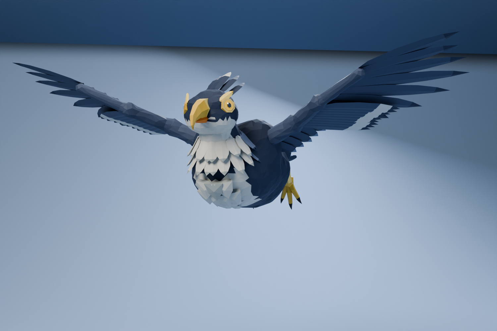

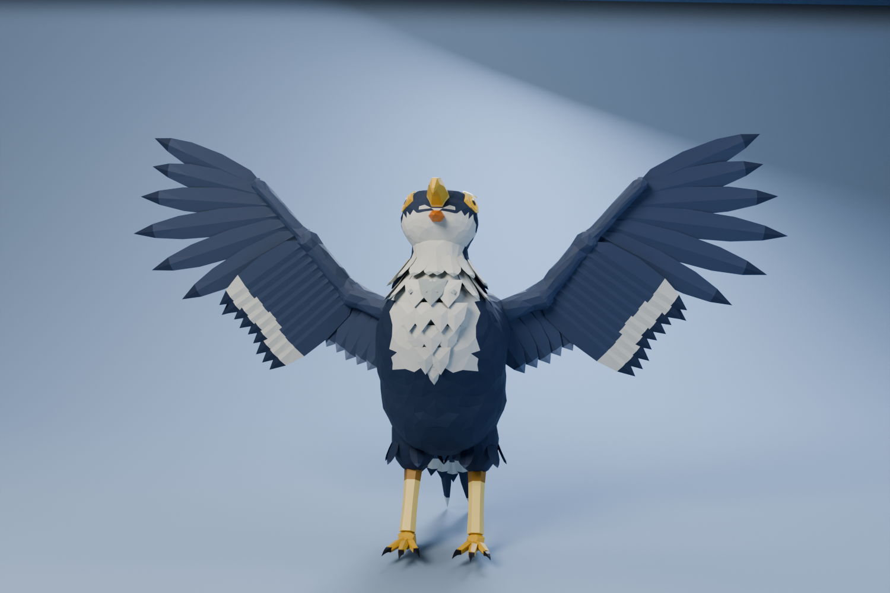

| | |
|---|---|
| 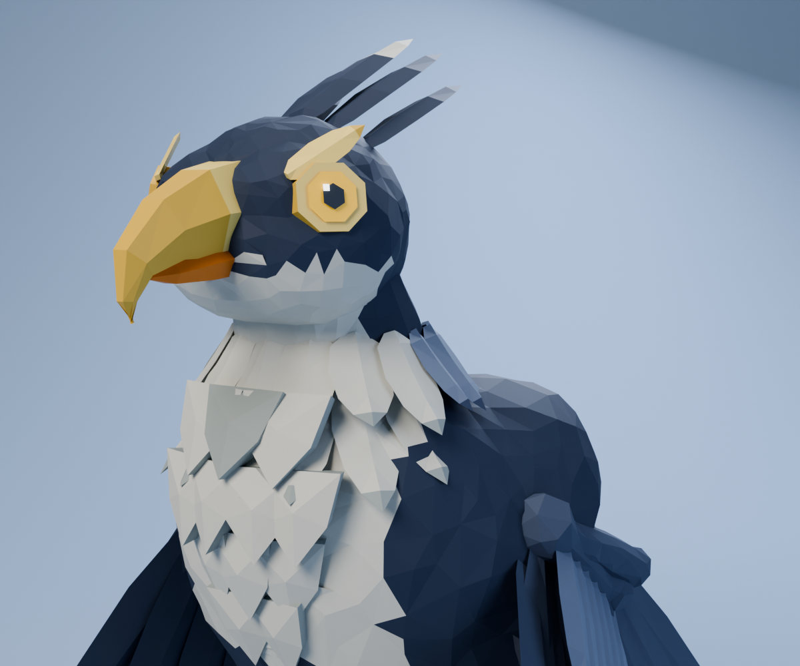 | 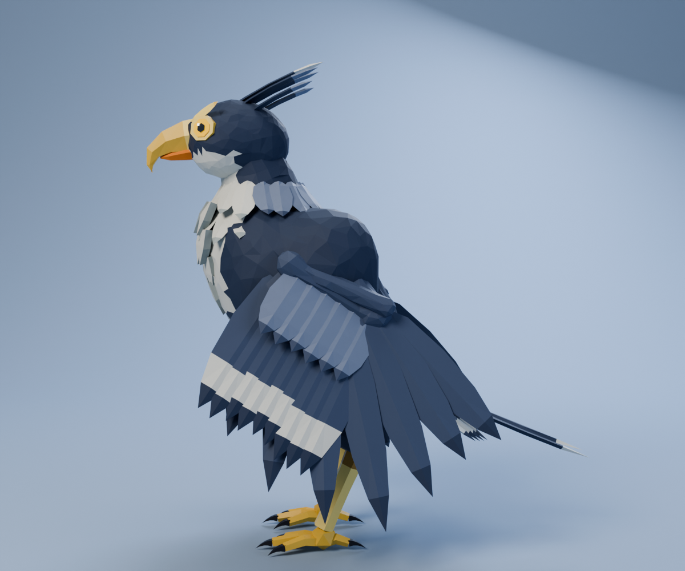 |
| 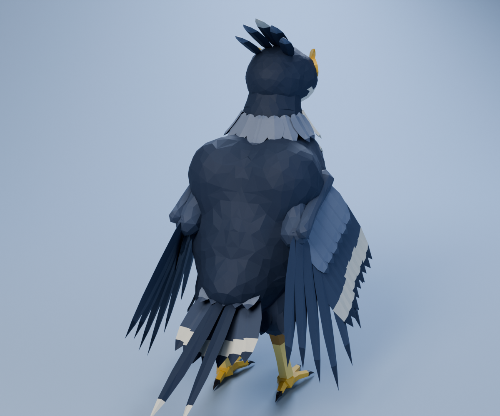 | 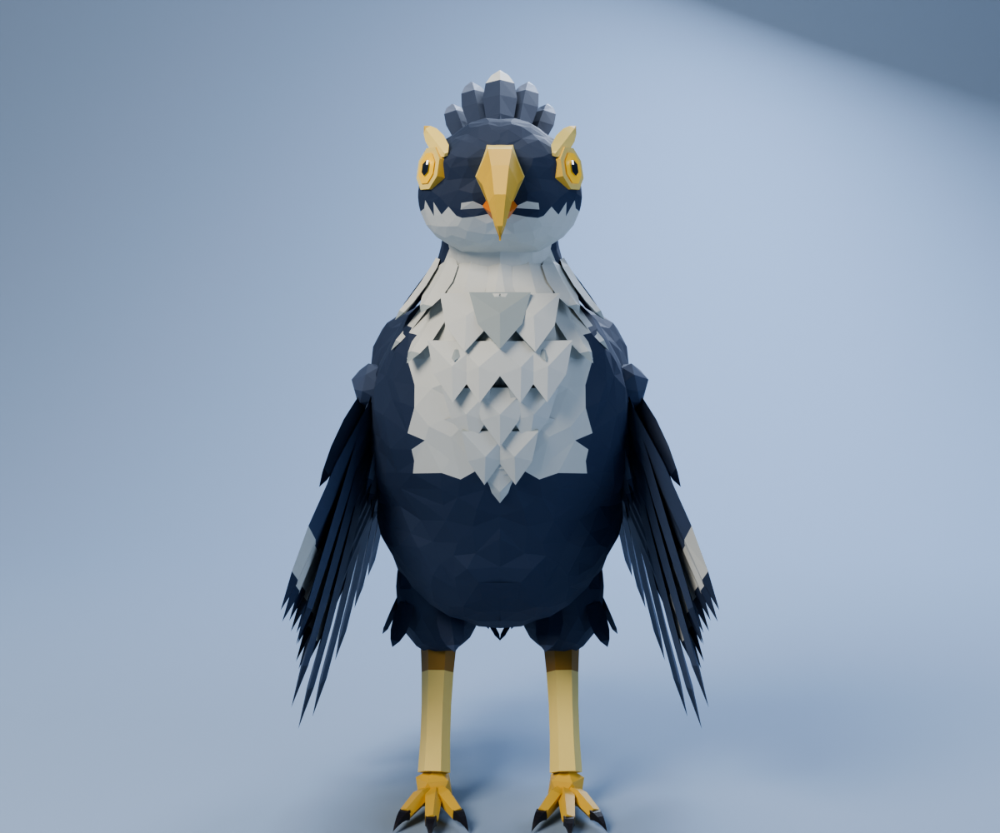 |

### Volando

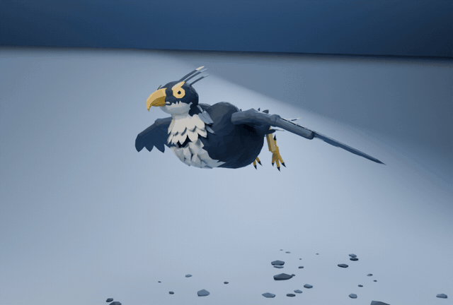

Aleteo de 0,8 s en bucle: el cuerpo se pone horizontal, las patas se recogen, las alas bajan con
fuerza y en la subida se recogen un poco; antebrazo y mano siguen al hombro con retraso, como un ave real.
MP4: [`renders/Zephalcon_vuelo.mp4`](renders/Zephalcon_vuelo.mp4)

### Caminando

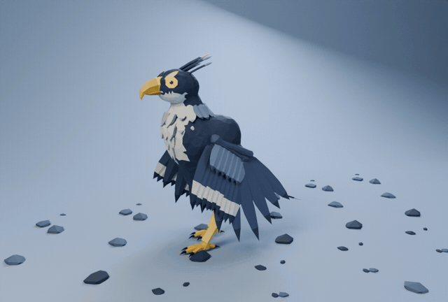

Paso de ave de 1 s con cinemática inversa en cada pata (el talón queda hacia atrás), los pies
plantados mientras apoyan, cabeceo y balanceo de la cola. MP4: [`renders/Zephalcon_caminata.mp4`](renders/Zephalcon_caminata.mp4)

### Girando

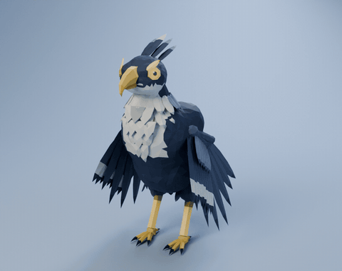

En reposo con las alas plegadas: respira y mira a los lados con giros rápidos de cabeza, como un pájaro.

## Partes del modelo

Son 23 piezas, cada una con su pivote en la articulación:

| Zona | Piezas |
|---|---|
| Cabeza | `Craneo` (con pico superior ganchudo), `Mandibula` (pico inferior naranja), `Ojos` (anillo dorado, iris, pupila, máscara), `Cresta` |
| Cuerpo | `Cuello`, `Cuello__Collar`, `Torso`, `Torso__Pechera` (chevrones) |
| Alas ×2 | `Ala_Brazo` (coberteras), `Ala_Antebrazo` (secundarias con banda blanca), `Ala_Mano` (primarias) |
| Patas ×2 | `Pata_Muslo` (con "pantalones" de plumas), `Pata_Tarso` (dorado con escamas), `Pata_Pie` (4 dedos), `Pata_Garras` |
| Cola | `Cola` (abanico, coberteras y dos estelas) |

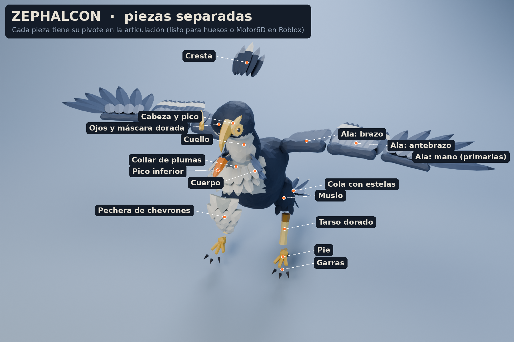

## Archivos

```
zephalcon/
├── renders/        renders, hoja de concepto, vista explotada, GIFs de vuelo, caminata y giro
├── blender/
│   ├── Zephalcon.blend        23 piezas con materiales y pivotes + estudio de luces (F12 renderiza)
│   └── Zephalcon_Rig.blend    esqueleto (18 huesos) + acciones Reposo, Caminar, Aletear y Grito
├── roblox/
│   ├── Zephalcon_Roblox_Rig.fbx      modelo con esqueleto, listo para importar (19 MeshParts)
│   ├── Zephalcon_Roblox_Partes.fbx   23 piezas sueltas sin esqueleto (para Motor6D)
│   ├── Zephalcon_Anim_Reposo.fbx     reposo con alas plegadas, 3 s en bucle
│   ├── Zephalcon_Anim_Caminar.fbx    caminata en el lugar, 1 s en bucle
│   ├── Zephalcon_Anim_Aletear.fbx    aleteo de vuelo, 0,8 s en bucle
│   ├── Zephalcon_Anim_Grito.fbx      abre las alas y grita, 2,5 s
│   ├── Zephalcon_Paleta.png          textura de paleta (512×256)
│   └── SetupZephalcon.server.lua     animaciones y modos: reposo (con gritos), patrulla o vuelo en círculos
└── modelos/Zephalcon.glb    modelo completo con materiales originales y las cuatro animaciones
```

El código está en [`../fuente/`](../fuente/) (`build_zephalcon.py` y los scripts compartidos).

## Importarlo en Roblox Studio

1. **File → Import 3D** con `roblox/Zephalcon_Roblox_Rig.fbx` (rig personalizado, no humanoide).
   El archivo está en "pose en T" con las alas abiertas; las animaciones las pliegan.
2. Si la paleta no aparece, sube `Zephalcon_Paleta.png` y ponla como `TextureID` de las MeshParts.
3. Pon `SetupZephalcon.server.lua` como **Script** dentro del Model.
4. Publica las cuatro animaciones desde el **Animation Editor** (Import → From FBX Animation) y pega
   sus IDs en el script.
5. Elige `MODO`:
   - `"reposo"`: respira, mira a los lados y grita cada `GRITAR_CADA` segundos.
   - `"patrulla"`: camina ida y vuelta a la velocidad justa para que los pies no patinen
     (0,571 m/s con el tamaño original; el script la escala si lo importaste a otro tamaño).
   - `"vuelo"`: vuela en círculos aleteando (`RADIO_VUELO`, `ALTURA_VUELO`).

Zephalcon no tiene partes de magma ni Neon: todas las piezas usan la paleta.

## Cómo está hecho

Mismo flujo que la línea de Vulcanid (metaballs → remesh → decimate con simetría → piezas por ray
casting), con piezas nuevas para aves:

1. **Plumas low-poly**: láminas con raquis central levantado, ancho máximo al 40 %, punta afilada,
   curvatura y giro, con bandas de color (las franjas blancas de las alas y la cola).
2. **Chevrones** para la pechera: placas en "V" abombadas, en filas que se superponen de arriba hacia abajo.
3. **Alas de 3 segmentos**: cada segmento tiene una orientación "plegada" calculada con marcos
   ortonormales (dirección del hueso + dirección de las plumas). Las animaciones mezclan entre abierta
   y plegada con *slerp*, y encima suman aleteo, retraso de antebrazo y mano, barrido y cabeceo.
4. **IK de dos huesos** para las patas con el talón hacia atrás.
