# Zephyrex — forma final de Zephyrian (Aetherials)

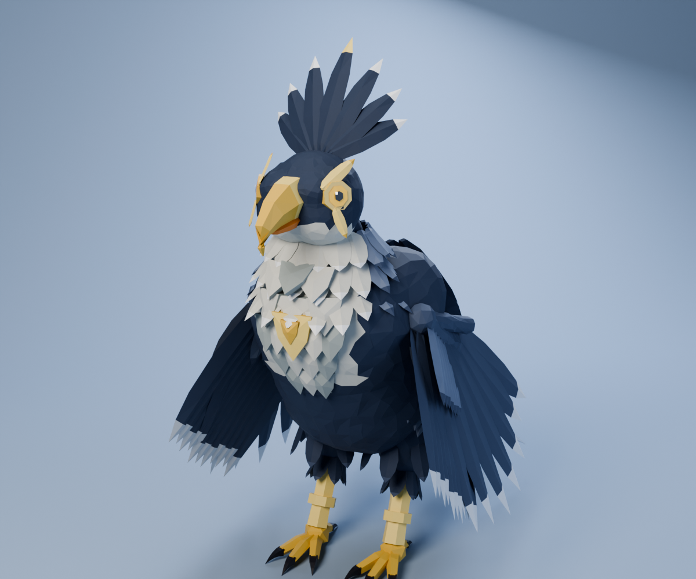

> Nombre provisorio: *Zephyrex* (céfiro + *rex*, "el rey del viento"). Lo puedes cambiar sin tocar el modelo.

## Concepto

Zephalcon madura y se vuelve el **rey de los cielos**. La cresta se abre en una **corona de plumas
en abanico** detrás de la cabeza, sobre los hombros le crece una **capa de plumas** y en el centro de la
pechera aparece un **emblema dorado**. La máscara dorada se cierra en un **visor** con la "lágrima" de
los halcones bajo el ojo. Sus alas son enormes, con **doble banda clara y puntas plateadas**, y la cola
lleva **cuatro estelas** que ondulan como cintas; las dos centrales tienen una banda de oro.

| | |
|---|---|
| Línea evolutiva | Zephyrian → [Zephalcon](../zephalcon/) → **Zephyrex** |
| Tipo | Neutro |
| Tamaño del modelo | 3,6 m de alto (con la corona) · 3,6 m de largo (con las estelas) · 7,1 m de envergadura |
| Postura | rapaz erguida y regia; camina, vuela y grita |

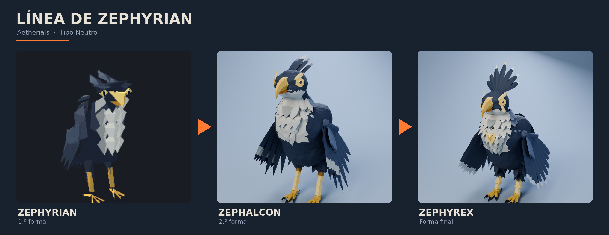

### Qué hereda de la línea

- **De Zephyrian:** azul marino, alas pizarra, pecho blanco en "V", anillo dorado en el ojo, pico
  ganchudo dorado con la parte inferior naranja, patas y dedos dorados, garras oscuras.
- **De Zephalcon:** pechera de chevrones, collar de plumas (ahora triple), máscara dorada, bandas
  claras en las alas, cola con estelas, "pantalones" de plumas.

### Qué cambia (la escalada)

- **Corona en abanico** de 7 plumas, con la central de punta dorada.
- **Capa de plumas** escapulares sobre los hombros y la espalda, con puntas plateadas.
- **Emblema dorado** en el centro de la pechera.
- **Visor dorado** con lágrima de halcón bajo el ojo; pico más grande con el gancho oscuro.
- **Alas enormes**: 11 secundarias y 8 primarias con doble banda, puntas plateadas y álula.
- **Cuatro estelas** en la cola (dos de ellas con giro, como cintas).
- **Botas de plumas** sobre el tarso y un **anillo de oro**; garras más grandes.
- Un 35 % más grande que Zephalcon.

Sigue siendo Neutro, sin brillos elementales, y con la paleta propia de la línea (azul marino,
blanco, oro y ahora plata).

## Galería

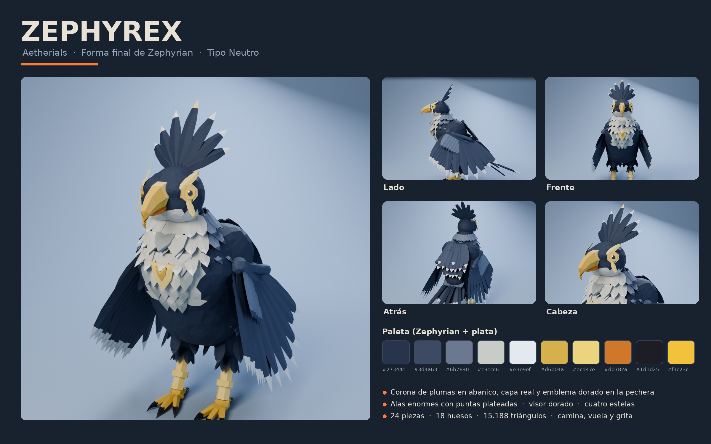

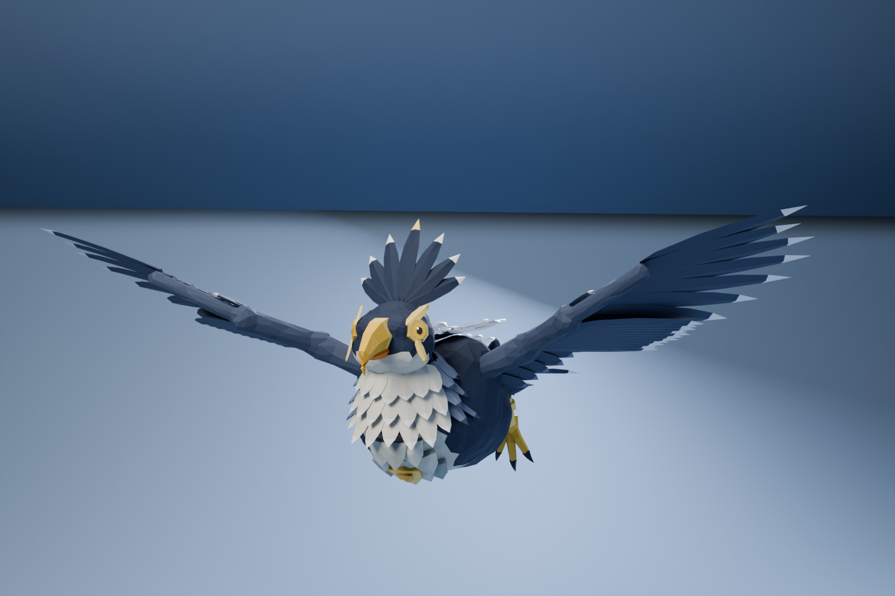

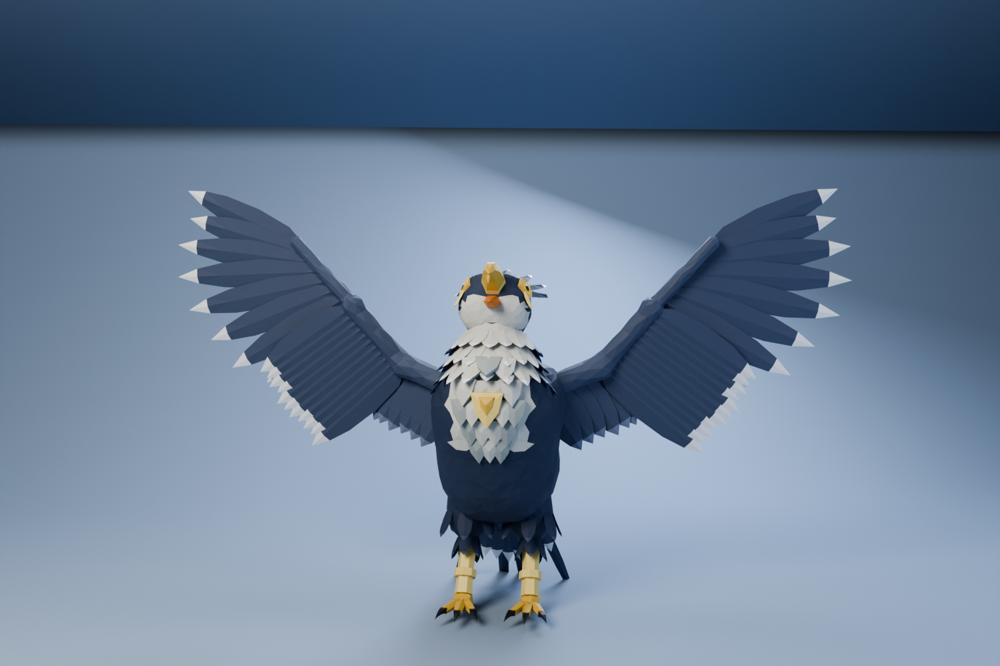

| | |
|---|---|
| 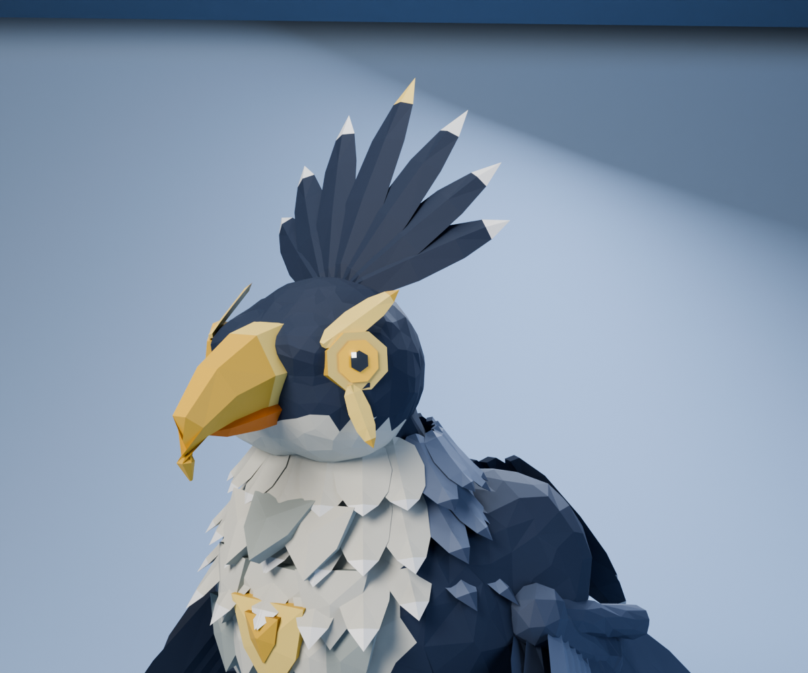 | 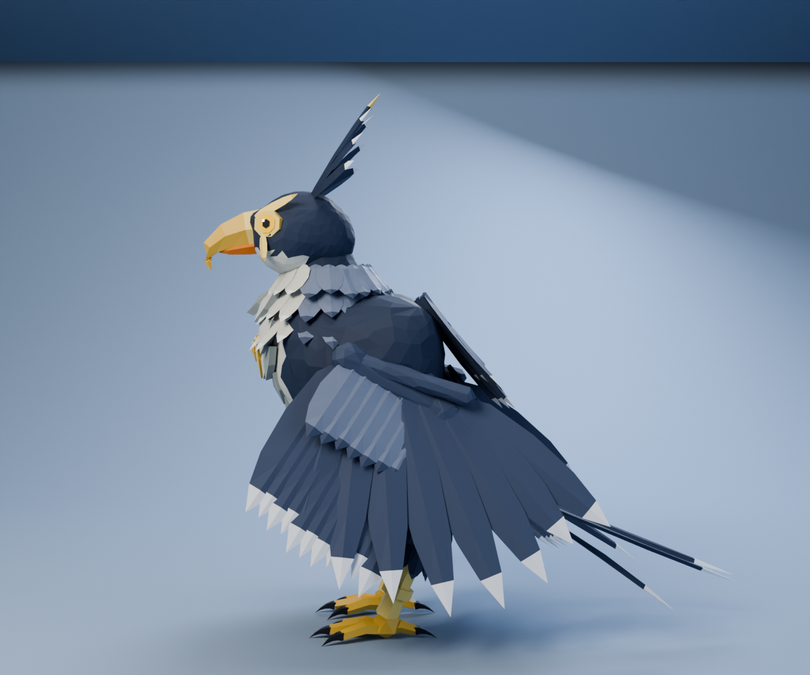 |
| 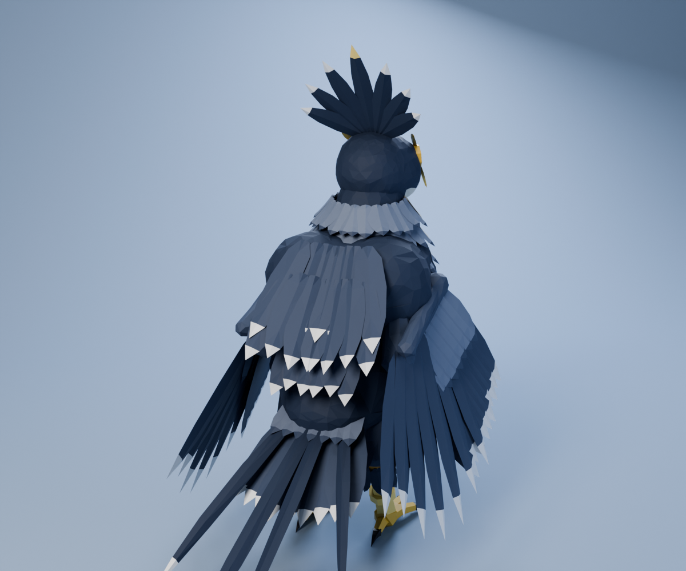 | 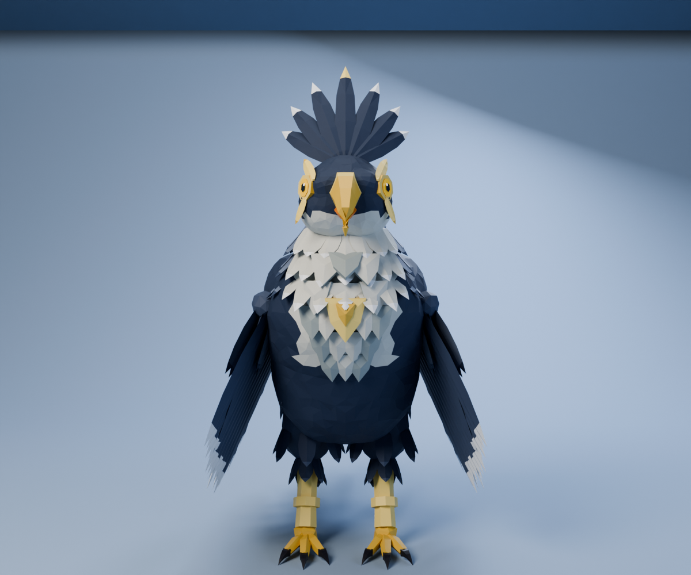 |

### Volando

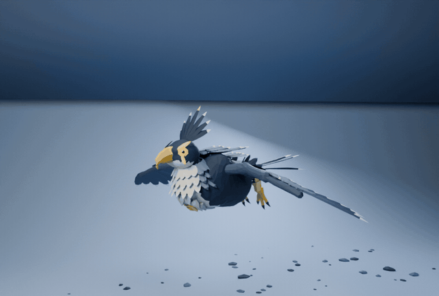

MP4: [`renders/Zephyrex_vuelo.mp4`](renders/Zephyrex_vuelo.mp4)

### Caminando

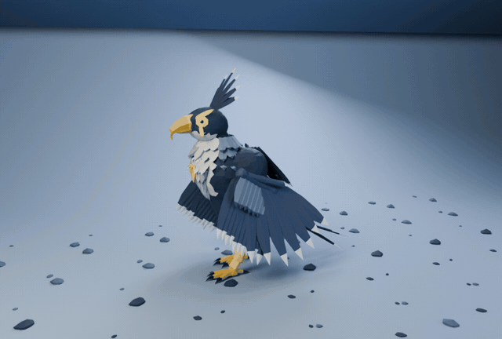

MP4: [`renders/Zephyrex_caminata.mp4`](renders/Zephyrex_caminata.mp4)

### Girando

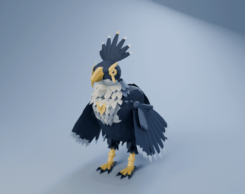

## Partes del modelo

Son 24 piezas, cada una con su pivote en la articulación:

| Zona | Piezas |
|---|---|
| Cabeza | `Craneo` (pico superior), `Mandibula` (pico inferior), `Ojos` (anillo, iris, pupila, visor y lágrima), `Cresta` (corona en abanico) |
| Cuerpo | `Cuello`, `Cuello__Collar` (triple), `Torso`, `Torso__Pechera` (chevrones + emblema), `Torso__Capa` |
| Alas ×2 | `Ala_Brazo`, `Ala_Antebrazo`, `Ala_Mano` (primarias y álula) |
| Patas ×2 | `Pata_Muslo`, `Pata_Tarso` (botas de plumas y anillo de oro), `Pata_Pie`, `Pata_Garras` |
| Cola | `Cola` (abanico, coberteras y cuatro estelas) |

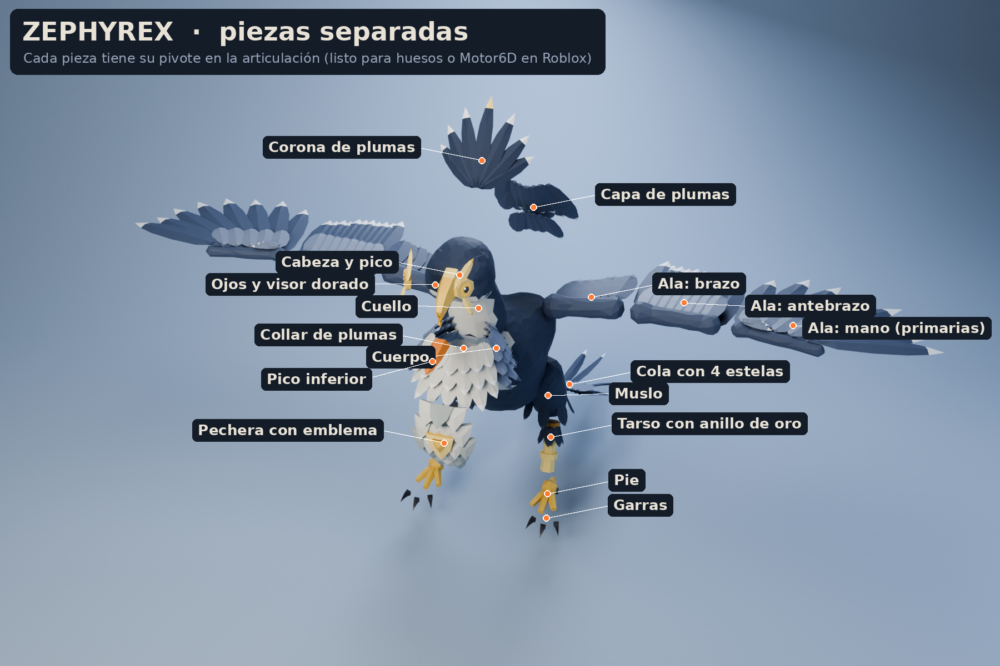

## Archivos

```
zephyrex/
├── renders/        renders, hoja de concepto, línea evolutiva, vista explotada, GIFs de vuelo, caminata y giro
├── blender/
│   ├── Zephyrex.blend        24 piezas con materiales y pivotes + estudio de luces (F12 renderiza)
│   └── Zephyrex_Rig.blend    esqueleto (18 huesos) + acciones Reposo, Caminar, Aletear y Grito
├── roblox/
│   ├── Zephyrex_Roblox_Rig.fbx      modelo con esqueleto, listo para importar (20 MeshParts)
│   ├── Zephyrex_Roblox_Partes.fbx   24 piezas sueltas sin esqueleto (para Motor6D)
│   ├── Zephyrex_Anim_Reposo.fbx     reposo con alas plegadas, 3 s en bucle
│   ├── Zephyrex_Anim_Caminar.fbx    caminata en el lugar, 1,1 s en bucle
│   ├── Zephyrex_Anim_Aletear.fbx    aleteo de vuelo, 0,8 s en bucle
│   ├── Zephyrex_Anim_Grito.fbx      abre las alas y grita, 2,5 s
│   ├── Zephyrex_Paleta.png          textura de paleta (512×256)
│   └── SetupZephyrex.server.lua     animaciones y modos: reposo (con gritos), patrulla o vuelo en círculos
└── modelos/Zephyrex.glb    modelo completo con materiales originales y las cuatro animaciones
```

El código está en [`../fuente/`](../fuente/) (`build_zephyrex.py` y los scripts compartidos).

## Importarlo en Roblox Studio

Igual que Zephalcon:

1. **File → Import 3D** con `roblox/Zephyrex_Roblox_Rig.fbx` (rig personalizado, no humanoide). El
   archivo está en "pose en T" con las alas abiertas; las animaciones las pliegan.
2. Si la paleta no aparece, sube `Zephyrex_Paleta.png` y ponla como `TextureID` de las MeshParts.
3. Pon `SetupZephyrex.server.lua` como **Script** dentro del Model, publica las cuatro animaciones
   (Animation Editor → Import → From FBX Animation) y pega sus IDs.
4. Elige `MODO`: `"reposo"` (mira a los lados y grita cada tanto), `"patrulla"` (camina a 0,681 m/s
   con el tamaño original, sin patinar) o `"vuelo"` (vuela en círculos aleteando).

### Triángulos

20 MeshParts y 15.188 triángulos en total. La pieza más pesada es el collar triple (2.570), muy por
debajo del límite de Roblox.

## Cómo está hecho

Igual que Zephalcon (plumas y chevrones low-poly, alas de 3 segmentos con plegado por *slerp*, IK en
las patas), con dos cambios:

- **Se modela a la escala de Zephalcon y al final se escala ×1,35** (piezas, pivotes, esqueleto y
  parámetros de caminata y cámara), así las proporciones de diseño se comparan directo con la forma anterior.
- **Plegado de alas propio** (`wing_fold` en la escena): como las primarias son más largas, la mano se
  pliega más hacia atrás para que no arrastren por el suelo.
